---
## Front matter
# Front matter
lang: ru-RU
title: "Лабораторная работа №1"
subtitle: "Установка и конфигурация операционной системы на виртуальную машину"
author: " Кармацкий Н. С. Группа НФИбд-01-21 "
institute:
  - Российский университет дружбы народов, Москва, Россия
date: 7 Сентября 2024

## i18n babel
babel-lang: russian
babel-otherlangs: english

## Formatting pdf
toc: false
toc-title: Содержание
slide_level: 2
aspectratio: 169
section-titles: true
theme: metropolis
header-includes:
 - \metroset{progressbar=frametitle,sectionpage=progressbar,numbering=fraction}
 - '\makeatletter'
 - '\beamer@ignorenonframefalse'
 - '\makeatother'
---

# Цель работы

Установка ОС на Virtual Box(в нашем случае на VMware Fusion) для дальнейшего использования в ходе прохождения курса.

# Задание

1. Установить ОС на VMware Fusion.
2. Получите следующую информацию.
   1. Версия ядра Linux (Linux version).
   2. Частота процессора (Detected Mhz processor).
   3. Модель процессора (CPU0).
   4. Объем доступной оперативной памяти (Memory available).
   5. Тип обнаруженного гипервизора (Hypervisor detected).
   6. Тип файловой системы корневого раздела.
   7. Последовательность монтирования файловых систем. [1]

# Теоретическое введение

Виртуальная машина (VM, от англ. virtual machine) — программная и/или аппаратная система, эмулирующая аппаратное обеспечение некоторой платформы (guest — гостевая платформа) и исполняющая программы для guest-платформы на host-платформе (host — хост-платформа, платформа-хозяин) или виртуализирующая некоторую платформу и создающая на ней среды, изолирующие друг от друга программы и даже операционные системы; также спецификация некоторой вычислительной среды. [2]

**VMware Fusion**  — гипервизор, позволяющий в среде macOS на базе платформы Intel и AppleSilicon создавать и запускать виртуальные машины, предоставляющие возможность запускать приложения, разработанные для других операционных систем, в том числе Windows и Linux. Поддерживаются как 32-разрядные, так и 64-разрядные версии ОС.

# Выполнение лабораторной работы

## Установка ОС

Предварительно были скачаны Virtual Box (и установлена) и дистрибутив Rocky.

Создаем новую виртуальную машину и настариваем.

# Настройка VM. Часть 1.

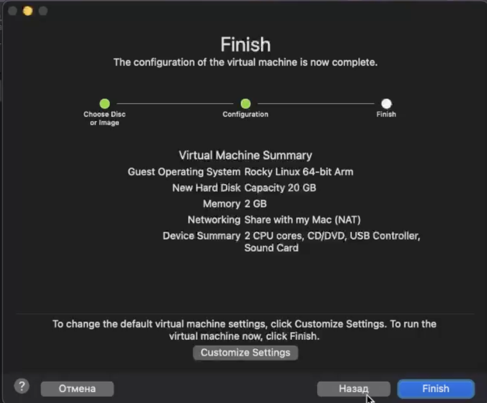{ #fig:001 width=60% height=60% }

# Настройка VM. Часть 2.

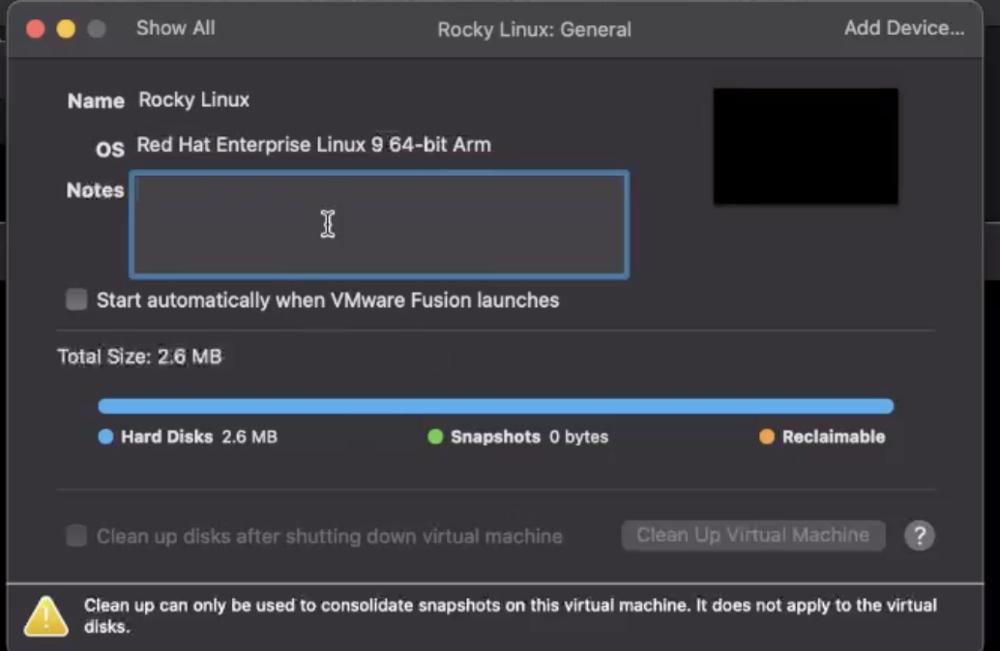{ #fig:002 width=60% height=60% }

# Запуск VM. 

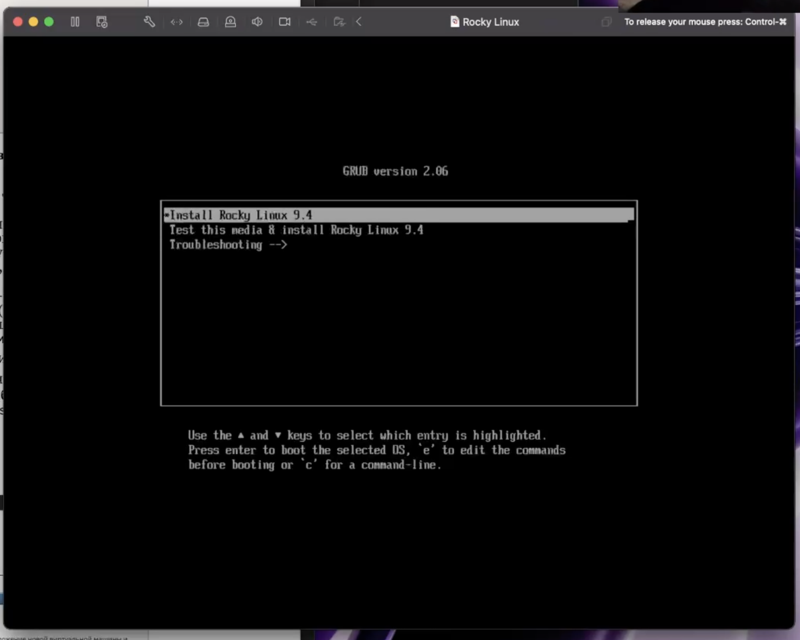{ #fig:003 width=60% height=60% }

# Настройки ОС. Часть 1.

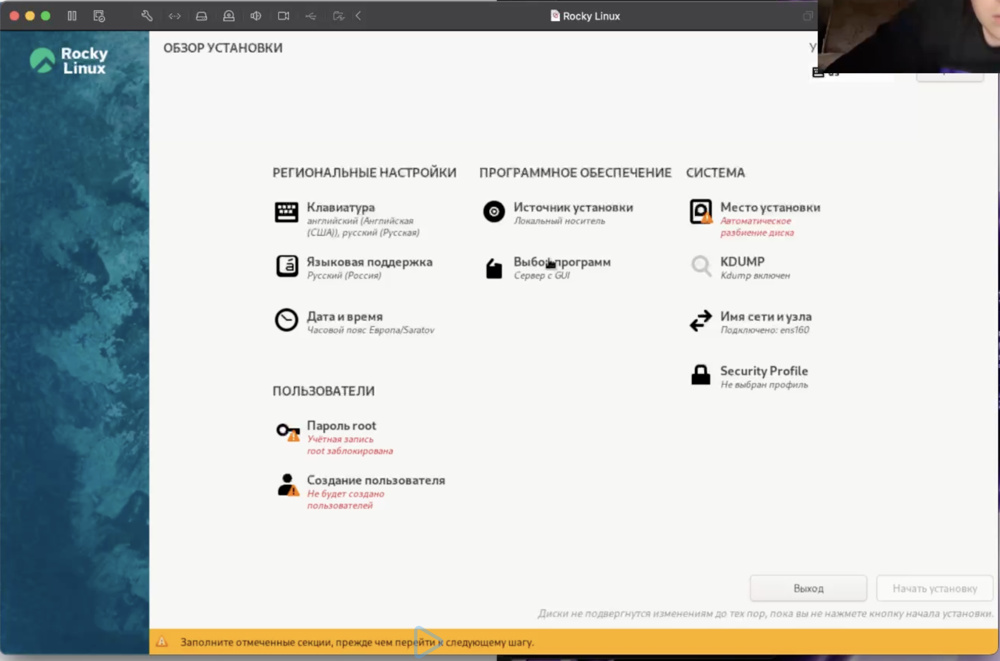{ #fig:004 width=60% height=60% }

# Настройки ОС. Часть 2.

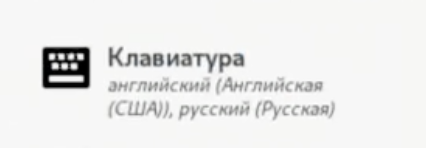{ #fig:05 width=60% height=60% }

# Настройки ОС. Часть 3.

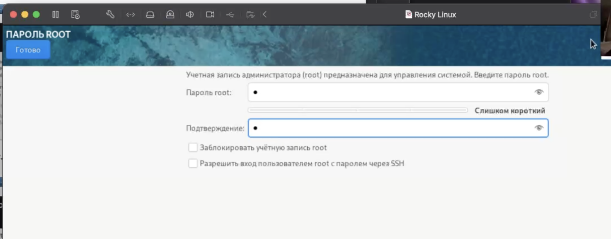{ #fig:006 width=60% height=60% }

# Настройки ОС. Часть 4.

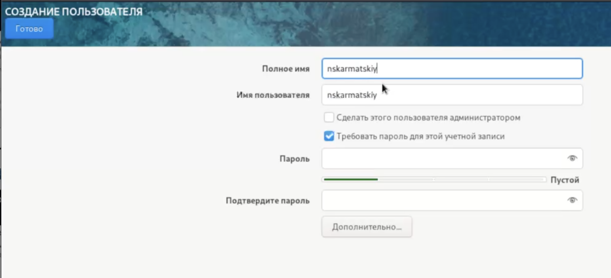{ #fig:007 width=60% height=60% }

# Настройки ОС. Часть 5.

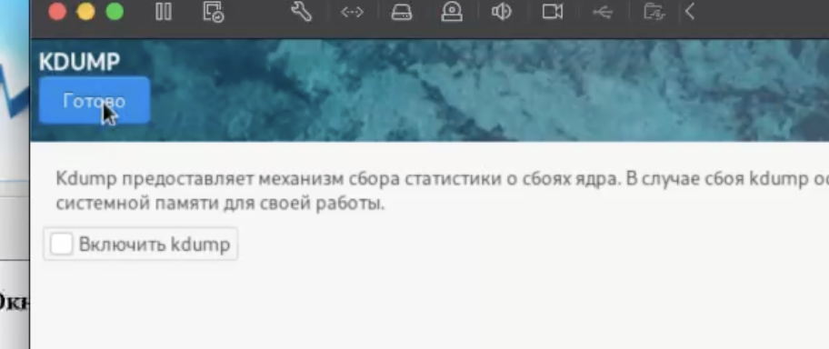{ #fig:08 width=60% height=60% }

# Настройки ОС. Часть 6.

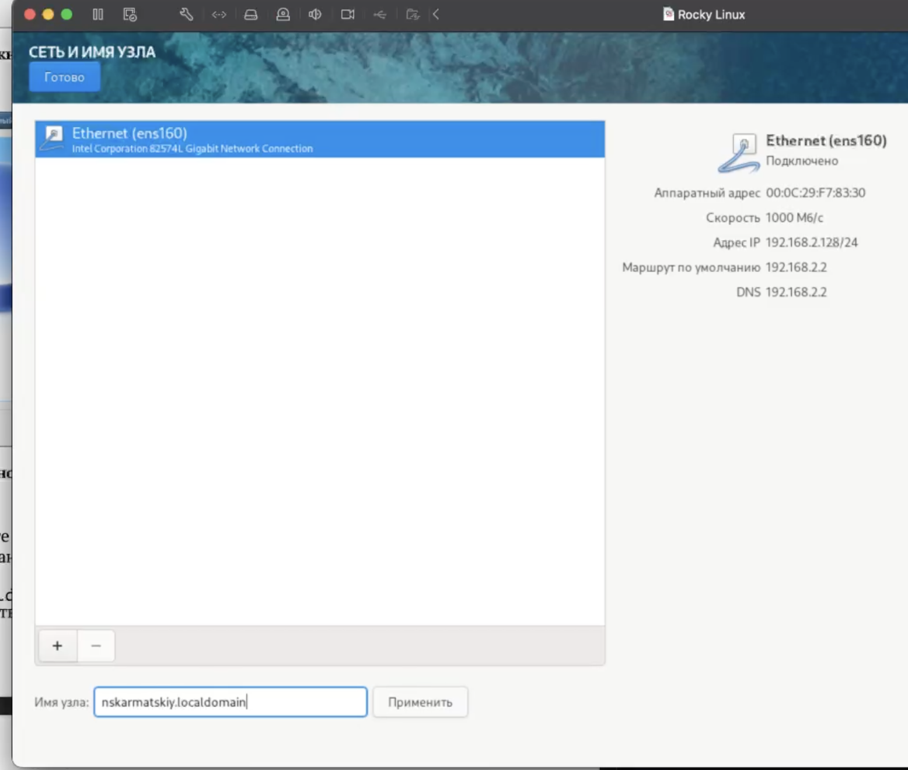{ #fig:09 width=60% height=60% }

# Настройка OC. Часть 7.

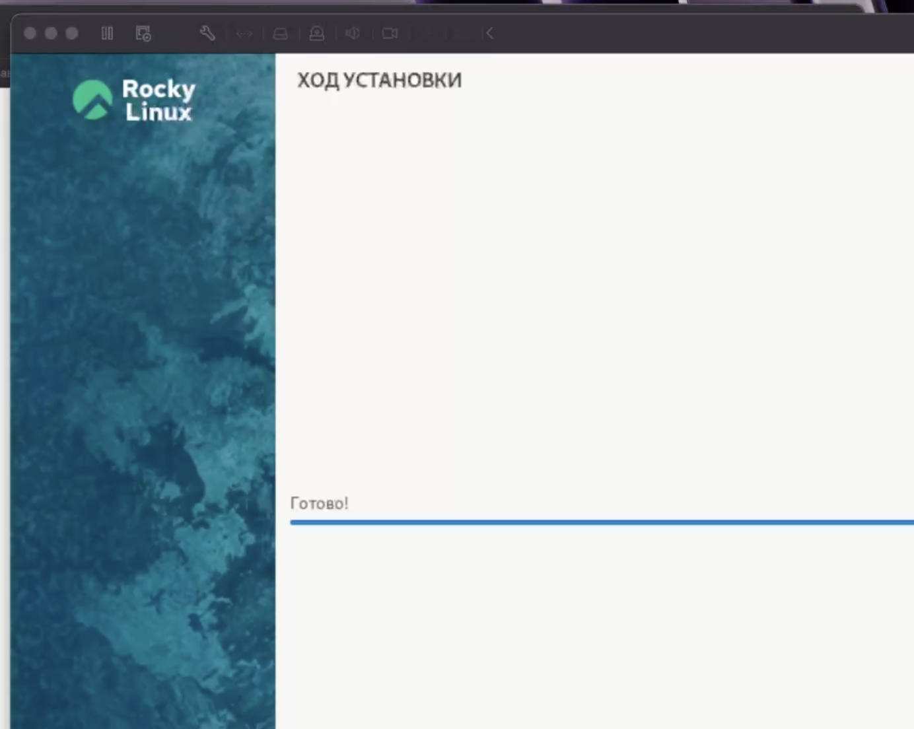{ #fig:010 width=60% height=60% }

# Запуск виртуальной машины и вход в систему

1. Перезагружаем виртуальную машину после установки и входим под своей учетной записью. 

{ #fig:011 width=60% height=60% }

# Поиск информации через терминал

1. Открываем терминал. Применяем команды и dmesg | less. 
   
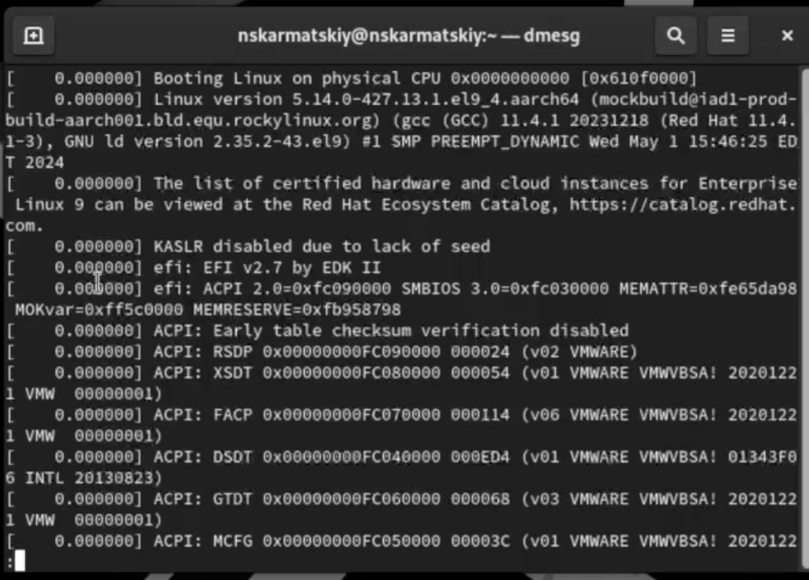{ #fig:012 width=60% height=60% }

# Поиск информации через терминал

1. Начинаем поиск информации с помощью команд grep | -i "ключевое слово". Для поиска информации о файловых системах используем команды df -Th и findmnt.
  
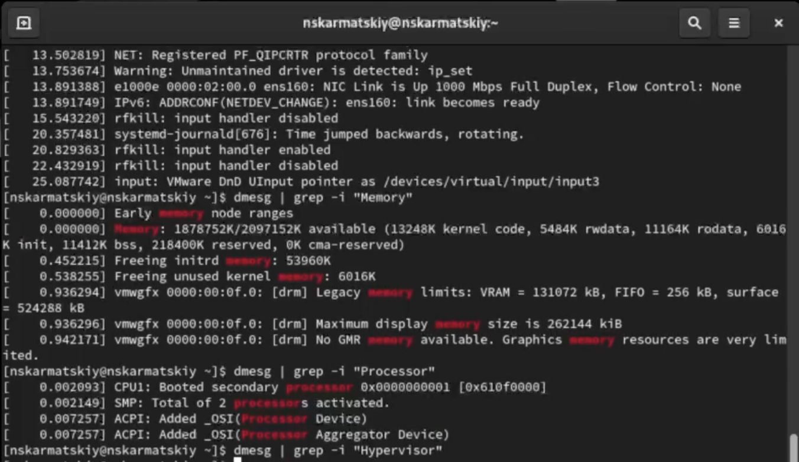{ #fig:013 width=60% height=60% }

# Поиск информации через терминал

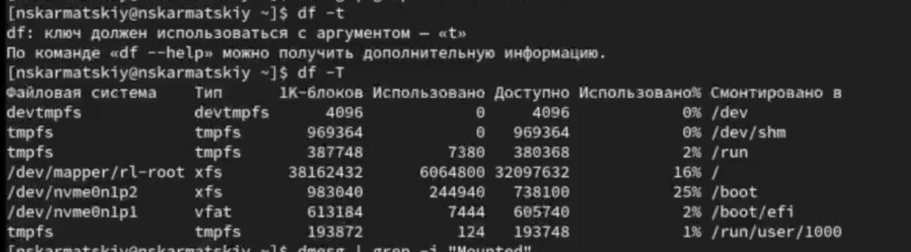{ #fig:014 width=60% height=60% }

# Вывод

В ходе выполнения лабораторной работы была установлена новая ОС на новую виртуальную машину. Так была найдена следующая информация:

- версия ядра Linux: 5.14.0-427.13.1.el19_4.aarch64
- частота процессора: 3500 Mhz  
- модель процессора: Apple M2 @ 3.5Ghz 
- обьем доступной оперативной памяти: 187675К/20966969К
- тип обнаруженного гипервизора: KVM
- тип файловой системы корневого раздела: xfc
- последовательность монтирования файловых систем

# Библиография

1. Методические материалы курса.
2. Wikipedia: Виртуальная машина. (https://ru.wikipedia.org/wiki/%D0%92%D0%B8%D1%80%D1%82%D1%83%D0%B0%D0%BB%D1%8C%D0%BD%D0%B0%D1%8F_%D0%BC%D0%B0%D1%88%D0%B8%D0%BD%D0%B0)
3. Документация по VMware Fusion: https://www.vmware.com/products/desktop-hypervisor/workstation-and-fusion
