---
## Front matter
# Front matter
lang: ru-RU
title: "Лабораторная работа №2"
subtitle: "Дискреционное разграничение прав в Linux. Основные атрибуты."
author: " Кармацкий Н. С. Группа НФИбд-01-21 "
institute:
  - Российский университет дружбы народов, Москва, Россия
date: 7 Сентября 2024

## i18n babel
babel-lang: russian
babel-otherlangs: english

## Formatting pdf
toc: false
toc-title: Содержание
slide_level: 2
aspectratio: 169
section-titles: true
theme: metropolis
header-includes:
 - \metroset{progressbar=frametitle,sectionpage=progressbar,numbering=fraction}
 - '\makeatletter'
 - '\beamer@ignorenonframefalse'
 - '\makeatother'
---

# Цель работы

Получение практических навыков работы в консоли с атрибутами файлов, закрепление теоретических основ дискреционного разграничения доступа в современных системах с открытым кодом на базе ОС Linux

## Теоретическая справка

**Права доступа** определяют, какие действия конкретный пользователь может или не может совершать с определенным файлами и каталогами. С помощью разрешений можно создать надежную среду — такую, в которой никто не может поменять содержимое ваших документов или повредить системные файлы. [2].

# Выполнение лабораторной работы

# 1. В установленной при выполнении предыдущей лабораторной работы операционной системе создаем учётную запись пользователя guest

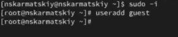{ #fig:001 width=100% height=50% }

# 2. Зададим пароль пользователя guest

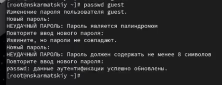{ #fig:002 width=100% height=50% }

# 3. Войдем в систему от имени пользователя guest

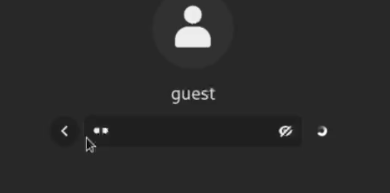{ #fig:003 width=100% height=50% }

# 4. Определим директорию, в которой мы находимся с помощью команды pwd. Сравним и определим является ли она нашей домашней директорией

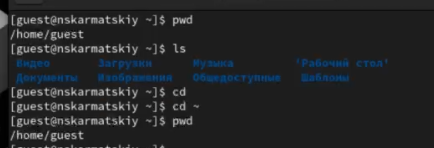{ #fig:004 width=100% height=50% }

Мы находимся в той же директории, что и наша домашняя

# 5. Уточним имя нашего пользователя командой whoami.

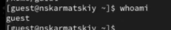{ #fig:05 width=100% height=50% }

# 6. Уточним группу пользователя, а так же группы в которые входит он. Сравним вывод команды id с выводом команды groups

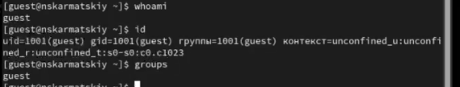{ #fig:006 width=100% height=50% }

Выводы двух команд идентичны, никаких разностей нет

# 7. Сравним полученную информацию об имени пользователя с данными, выводимыми в приглашении командной строки

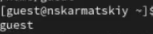{ #fig:007 width=100% height=50% }

Все верно, данные одинаковы

# 8. Просмотрим файл /etc/passwd и найдем в нем свою учетную запись и uid пользователя. Так же определим gid пользователя. Сравним значения с вывод предыдущих пунктов

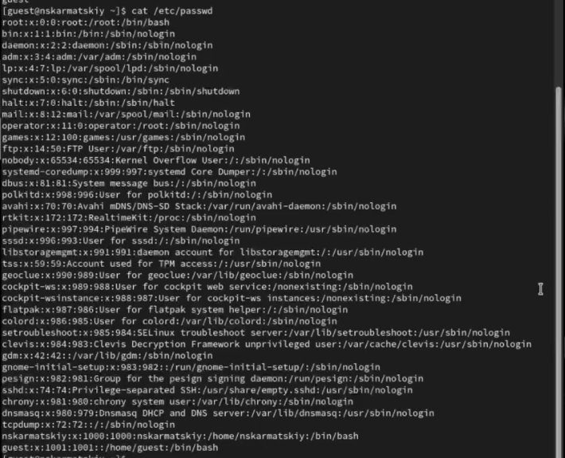{ #fig:08 width=85% height=50% }

gid: 1001
Значение с выводами предыдущих команд полностью идентичны

# 9. Определим существующие в системе директории командой. Проверим какие права установлены на директории

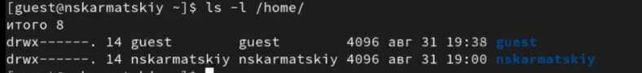{ #fig:09 width=100% height=50% }

Права на директорию установлены только для пользователя, он может делать все в ней, для других пользователей(кроме root) действия с этим каталогом недоступны

# 10. Проверьте, какие расширенные атрибуты установлены на поддиректориях, находящихся в директории /home

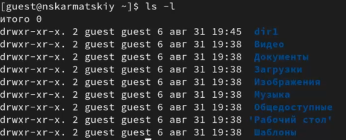{ #fig:010 width=100% height=50% }

# 10. Проверьте, какие расширенные атрибуты установлены на поддиректориях, находящихся в директории /home

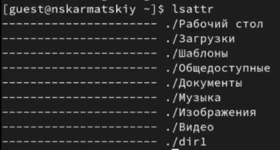{ #fig:010_1 width=100% height=50% }

Для всех кроме пользователя недоступна запись в каталоги

Атрибуты никакие не стоят для каталогов

# 11. Создаем директорию dir1 и снимаем с директории все атрибуты

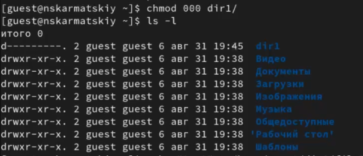{ #fig:011 width=100% height=50% }

# 12. Попытаемся создать файл в директории dir1

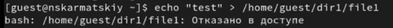{ #fig:012 width=100% height=50% }

# 13. Заполним таблицу «Установленные права и разрешённые действия», выполняя действия от имени владельца директории(файлов),определив опытным путём,какие операции разрешены, а какие нет.Если операция разрешена, занесем е втаблицу знак «+», если не разрешена, знак«-».

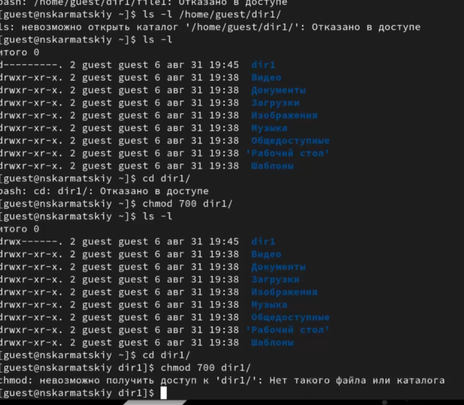{ #fig:013 width=85% height=60% }

# 14. На основании заполненной таблицы определим те или иные минимально необходимые права для выполнения операций внутри директории dir1

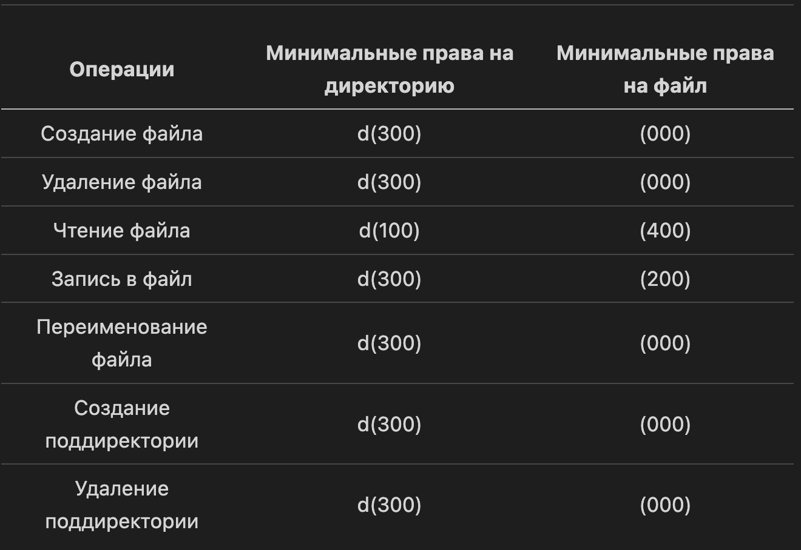{ #fig:014 width=85% height=60% }

# Вывод

Получены практических навыки работы в консоли с атрибутами файлов, закреплены теоретические основы дискреционного разграничения доступа в современных системах с открытым кодом на базе ОС Linux

# Библиография

1. Методические материалы курса.
2. Права доступа в OC Linux - https://codechick.io/tutorials/unix-linux/unix-linux-permissions
3. Руковсдство по команде lsattr - https://rus-linux.net/MyLDP/consol/Linux_lsattr_command.html
