---
## Front matter
title: "Отчёт по лабораторной работе №2

Информационная безопасность"
subtitle: "Дискреционное разграничение прав в Linux. Основные атрибуты."
author: "Кармацкий Никита Сергеевич, 

НФИбд-01-21, 1032210061"

babel-lang: russian 
babel-otherlangs: english 
mainfont: Arial 
monofont: Courier New 
fontsize: 9pt

## Generic otions
lang: ru-RU
toc-title: "Содержание"

## Bibliography
bibliography: bib/cite.bib
csl: pandoc/csl/gost-r-7-0-5-2008-numeric.csl

## Pdf output format
toc: true # Table of contents
toc-depth: 2
lof: true # List of figures
fontsize: 9pt
linestretch: 1.5
papersize: a4
documentclass: scrreprt
## I16n polyglossia
polyglossia-lang:
  name: russian
  options:
  - spelling=modern
  - babelshorthands=true
polyglossia-otherlangs:
  name: english
## I16n babel
babel-lang: russian
babel-otherlangs: english
## Fonts
mainfont: PT Serif
romanfont: PT Serif
sansfont: PT Sans
monofont: PT Mono
mainfontoptions: Ligatures=TeX
romanfontoptions: Ligatures=TeX
sansfontoptions: Ligatures=TeX,Scale=MatchLowercase
monofontoptions: Scale=MatchLowercase,Scale=0.6
## Biblatex
biblatex: true
biblio-style: "gost-numeric"
biblatexoptions:
  - parentracker=true
  - backend=biber
  - hyperref=auto
  - language=auto
  - autolang=other*
  - citestyle=gost-numeric
## Pandoc-crossref LaTeX customization
figureTitle: "Рис."
tableTitle: "Таблица"
listingTitle: "Листинг"
lofTitle: "Список иллюстраций"
lolTitle: "Листинги"
## Misc options
indent: true
header-includes:
  - \usepackage{indentfirst}
  - \usepackage{float} # keep figures where there are in the text
  - \floatplacement{figure}{H} # keep figures where there are in the text
---

# Цель работы

Получение практических навыков работы в консоли с атрибутами файлов, закрепление теоретических основ дискреционного разграничения доступа в современных системах с открытым кодом на базе ОС Linux

# Выполнение лабораторной работы

### 1. В установленной при выполнении предыдущей лабораторной работы операционной системе создаем учётную запись пользователя guest

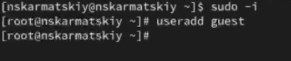{ #fig:001 width=100% height=50% }

### 2. Зададим пароль пользователя guest

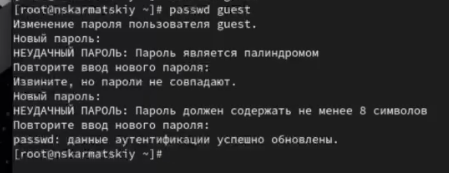{ #fig:002 width=100% height=50% }

### 3. Войдем в систему от имени пользователя guest

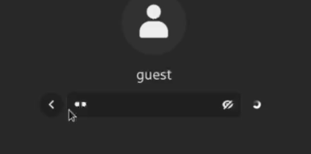{ #fig:003 width=100% height=50% }

### 4. Определим директорию, в которой мы находимся с помощью команды pwd. Сравним и определим является ли она нашей домашней директорией

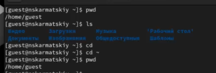{ #fig:004 width=100% height=50% }

Мы находимся в той же директории, что и наша домашняя

### 5. Уточним имя нашего пользователя командой whoami.

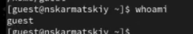{ #fig:05 width=100% height=50% }

### 6. Уточним группу пользователя, а так же группы в которые входит он. Сравним вывод команды id с выводом команды groups

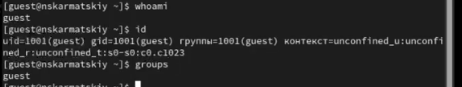{ #fig:006 width=100% height=50% }

Выводы двух команд идентичны, никаких разностей нет

### 7. Сравним полученную информацию об имени пользователя с данными, выводимыми в приглашении командной строки

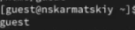{ #fig:007 width=100% height=50% }

Все верно, данные одинаковы

### 8. Просмотрим файл /etc/passwd и найдем в нем свою учетную запись и uid пользователя. Так же определим gid пользователя. Сравним значения с вывод предыдущих пунктов

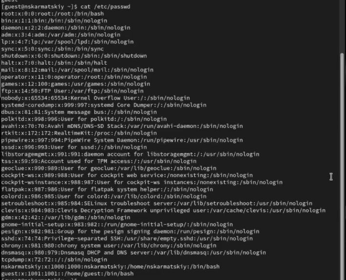{ #fig:08 width=100% height=50% }

gid: 1001
Значение с выводами предыдущих команд полностью идентичны

### 9. Определим существующие в системе директории командой. Проверим какие права установлены на директории

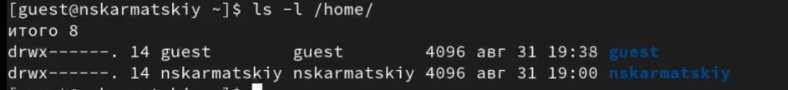{ #fig:09 width=100% height=50% }

Права на директорию установлены только для пользователя, он может делать все в ней, для других пользователей(кроме root) действия с этим каталогом недоступны

### 10. Проверьте, какие расширенные атрибуты установлены на поддиректориях, находящихся в директории /home

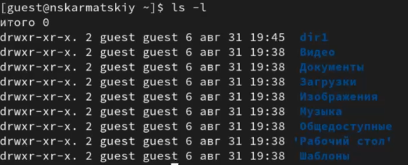{ #fig:010 width=100% height=50% }

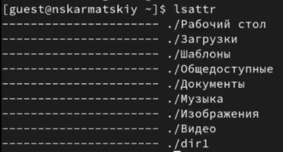{ #fig:010_1 width=100% height=50% }

Для всех кроме пользователя недоступна запись в каталоги

Атрибуты никакие не стоят для каталогов
### 11. Создаем директорию dir1 и снимаем с директории все атрибуты

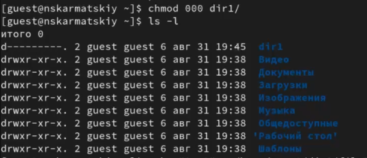{ #fig:011 width=100% height=50% }

### 12. Попытаемся создать файл в директории dir1

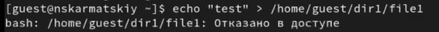{ #fig:012 width=100% height=50% }

### 13. Заполним таблицу «Установленные права и разрешённые действия», выполняя действия от имени владельца директории(файлов),определив опытным путём,какие операции разрешены, а какие нет.Если операция разрешена, занесем е втаблицу знак «+», если не разрешена, знак«-».

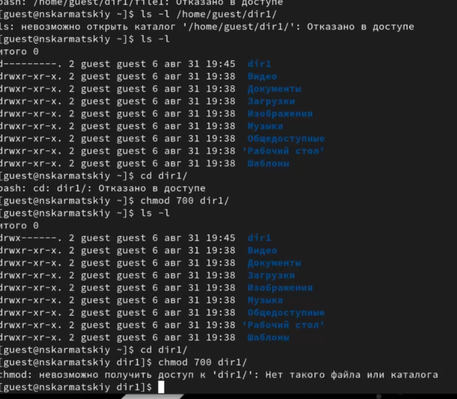{ #fig:013 width=100% height=50% }

| | | | | | | | | | |
|-|-|-|-|-|-|-|-|-|-|
|Права директории|Права  файла|Создание  файла|Удаление  файла|Запись  в файл|Чтение  файла|Смена  директории|Просмотр файлов в  директории|Переимено- вание файла|Смена  атрибутов  файла|
|d(000)|(000)| -| -| -| -| -| -| -| -|
|d(000)|(100)| -| -| -| -| -| -| -| -|
|d(000)|(200)| -| -| -| -| -| -| -| -|
|d(000)|(300)| -| -| -| -| -| -| -| -|
|d(000)|(400)| -| -| -| -| -| -| -| -|
|d(000)|(500)| -| -| -| -| -| -| -| -|
|d(000)|(600)| -| -| -| -| -| -| -| -|
|d(000)|(700)| -| -| -| -| -| -| -| -|
|d(100)|(000)| -| -| -| -|+| -| -|+|
|d(100)|(100)| -| -| -| -|+| -| -|+|
|d(100)|(200)| -| -|+| -|+| -| -|+|
|d(100)|(300)| -| -|+| -|+| -| -|+|
|d(100)|(400)| -| -|-|+|+| -| -|+|
|d(100)|(500)| -| -|-|+|+| -| -|+|
|d(100)|(600)| -| -|+|+|+| -| -|+|
|d(100)|(700)| -| -|+|+|+| -| -|+|
|d(200)|(000)| -| -|-|-|-| -| -|-|
|d(200)|(100)| -| -|-|-|-| -| -|-|
|d(200)|(200)| -| -|-|-|-| -| -|-|
|d(200)|(300)| -| -|-|-|-| -| -|-|
|d(200)|(400)| -| -|-|-|-| -| -|-|
|d(200)|(500)| -| -|-|-|-| -| -|-|
|d(200)|(600)| -| -|-|-|-| -| -|-|
|d(200)|(700)| -| -|-|-|-| -| -|-|
|d(300)|(000)|+|+|-|-|+| -|+|+|
|d(300)|(100)|+|+|-|-|+| -|+|+|
|d(300)|(200)|+|+|+|-|+| -|+|+|
|d(300)|(300)|+|+|+|-|+| -|+|+|
|d(300)|(400)|+|+|-|+|+| -|+|+|
|d(300)|(500)|+|+|-|+|+| -|+|+|
|d(300)|(600)|+|+|+|+|+| -|+|+|
|d(300)|(700)|+|+|+|+|+| -|+|+|
|d(400)|(000)|-|-|-|-|-|+|-|-|
|d(400)|(100)|-|-|-|-|-|+|-|-|
|d(400)|(200)|-|-|-|-|-|+|-|-|
|d(400)|(300)|-|-|-|-|-|+|-|-|
|d(400)|(400)|-|-|-|-|-|+|-|-|
|d(400)|(500)|-|-|-|-|-|+|-|-|
|d(400)|(600)|-|-|-|-|-|+|-|-|
|d(400)|(700)|-|-|-|-|-|+|-|-|
|d(500)|(000)|-|-|-|-|+|+|-|+|
|d(500)|(100)|-|-|-|-|+|+|-|+|
|d(500)|(200)|-|-|+|-|+|+|-|+|
|d(500)|(300)|-|-|+|-|+|+|-|+|
|d(500)|(400)|-|-|-|+|+|+|-|+|
|d(500)|(500)|-|-|-|+|+|+|-|+|
|d(500)|(600)|-|-|+|+|+|+|-|+|
|d(500)|(700)|-|-|+|+|+|+|-|+|
|d(600)|(000)|-|-|-|-|-|+|-|-|
|d(600)|(100)|-|-|-|-|-|+|-|-|
|d(600)|(200)|-|-|-|-|-|+|-|-|
|d(600)|(300)|-|-|-|-|-|+|-|-|
|d(600)|(400)|-|-|-|-|-|+|-|-|
|d(600)|(500)|-|-|-|-|-|+|-|-|
|d(600)|(600)|-|-|-|-|-|+|-|-|
|d(600)|(700)|-|-|-|-|-|+|-|-|
|d(700)|(000)|+|+|-|-|+|+|+|+|
|d(700)|(100)|+|+|-|-|+|+|+|+|
|d(700)|(200)|+|+|+|-|+|+|+|+|
|d(700)|(300)|+|+|+|-|+|+|+|+|
|d(700)|(400)|+|+|-|+|+|+|+|+|
|d(700)|(500)|+|+|-|+|+|+|+|+|
|d(700)|(600)|+|+|+|+|+|+|+|+|
|d(700)|(700)|+|+|+|+|+|+|+|+|

Таблица 2.1 «Установленные права и разрешённые действия»

### 14. На основании заполненной таблицы определим те или иные минимально необходимые права для выполнения операций внутри директории dir1

| | | | | |
|-|-|-|-|-|
|Операция| |Минимальные  права на  директорию| |Минимальные  права на файл|
|Создание файла| |d(300)| |(000)|
|Удаление файла| |d(300)| |(000)|
|Чтение файла| |d(100)| |(400)|
|Запись в файл| |d(100)| |(200)|
|Переименование файла| |d(300)| |(000)|
|Создание поддиректории| |d(300)| |(000)|
|Удаление поддиректории| |d(300)| |(000)|

Таблица 2.2 "Минимальные права для совершения операций"

# Вывод

Получены практических навыки работы в консоли с атрибутами файлов, закреплены теоретические основы дискреционного разграничения доступа в современных системах с открытым кодом на базе ОС Linux

# Список литературы. Библиография

[1] Права доступа в OC Linux - https://codechick.io/tutorials/unix-linux/unix-linux-permissions
[2] Руковсдство по команде lsattr - https://rus-linux.net/MyLDP/consol/Linux_lsattr_command.html
