---
## Front matter
# Front matter
lang: ru-RU
title: "Лабораторная работа №3"
subtitle: "Дискреционное разграничение прав в Linux. Два пользователя"
author: " Кармацкий Н. С. Группа НФИбд-01-21 "
institute:
  - Российский университет дружбы народов, Москва, Россия
date: 7 Сентября 2024

## i18n babel
babel-lang: russian
babel-otherlangs: english

## Formatting pdf
toc: false
toc-title: Содержание
slide_level: 2
aspectratio: 169
section-titles: true
theme: metropolis
header-includes:
 - \metroset{progressbar=frametitle,sectionpage=progressbar,numbering=fraction}
 - '\makeatletter'
 - '\beamer@ignorenonframefalse'
 - '\makeatother'
---

# Цель работы

Получить практические навыки работы в консоли с атрибутами файлов для групп пользователей

# Теоретическая справка

**Права доступа** определяют, какие действия конкретный пользователь может или не может совершать с определенным файлами и каталогами. С помощью разрешений можно создать надежную среду — такую, в которой никто не может поменять содержимое ваших документов или повредить системные файлы. [2].

# Теоретическая справка

**Группы пользователей Linux** кроме стандартных root и users, здесь есть еще пару десятков групп. Это группы, созданные программами, для управления доступом этих программ к общим ресурсам. Каждая группа разрешает чтение или запись определенного файла или каталога системы, тем самым регулируя полномочия пользователя, а следовательно, и процесса, запущенного от этого пользователя. Здесь можно считать, что пользователь - это одно и то же что процесс, потому что у процесса все полномочия пользователя, от которого он запущен. [2]

# Выполнение лабораторной работы

Начнем с запуска машины и входа в режим супер пользователя

# 1. В установленной операционной системе создайте учётную запись пользователя guest2 (используя учётную запись администратора)

Guest1 был создан в ходе выполнения лабораторной работы №2.

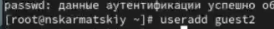{#fig:001 width=70%}

# 2. Задаем пароль для пользователя guest2.

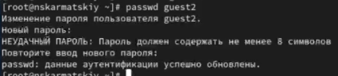{#fig:002 width=70%}

# 3. Добавим пользователя guest2 в группу guest:

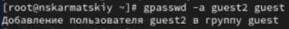{#fig:003 width=70%}

# 4. Осуществите вход в систему от двух пользователей на двух разных консолях.

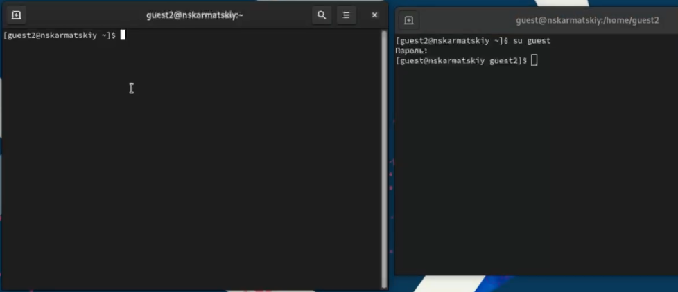{#fig:004 width=70%}

# 5. Для обоих пользователей командой pwd определим директорию, в которой мы находитесь. Сравним её с приглашениями командной строки
   
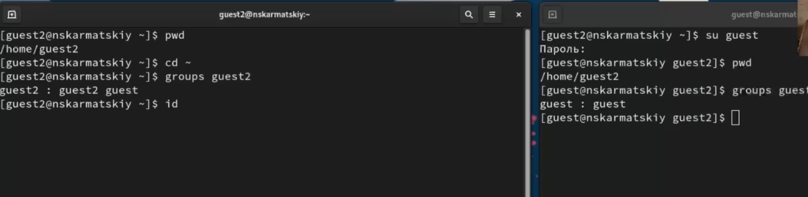{#fig:005 width=70%}

# 6. Уточним имя вашего пользователя, его группу, кто входит в неё и к каким группам принадлежит он сам. Определим командами
groups guest и groups guest2, в какие группы входят пользователи guest и guest2. Сравним вывод команды groups с выводом команд id -Gn и id -G :

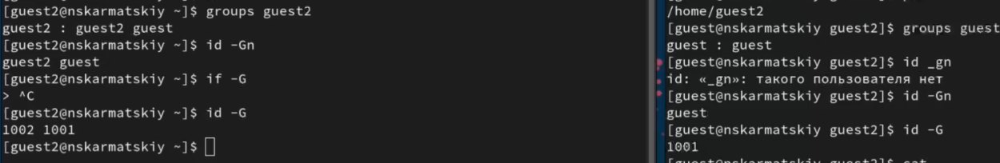{#fig:006 width=70%}

# 7. Сравним полученную информацию с содержимым файла /etc/group :

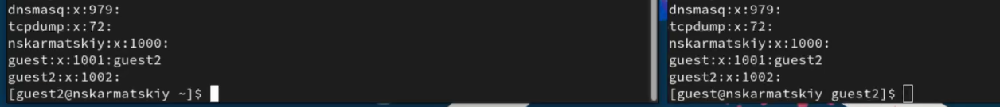{#fig:007 width=70%}

# 8. От имени пользователя guest2 выполним регистрацию пользователя guest2 в группе guest командой newgrp guest :

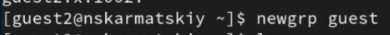{#fig:008 width=70%}

# 9.  От имени пользователя guest изменим права директории /home/guest, разрешив все действия для пользователей группы: chmod g+rwx /home/guest

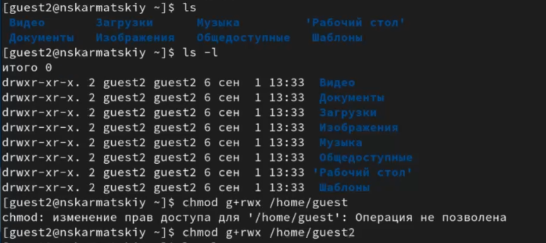{#fig:009 width=70%}

# 10.  От имени пользователя guest снимем с директории /home/guest/dir1 все атрибуты командой chmod 000 dir1 :

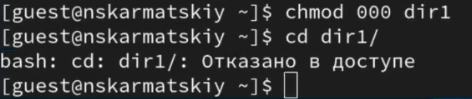{#fig:0010 width=70%}

# Заполнение таблицы 3.1

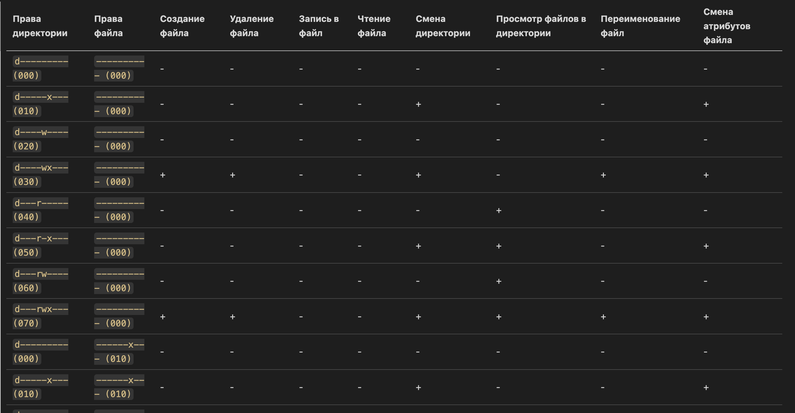{#fig:0011 width=70%}

Таблица 3.1 «Установленные права и разрешённые действия для групп»

# Заполнение таблицы 3.2

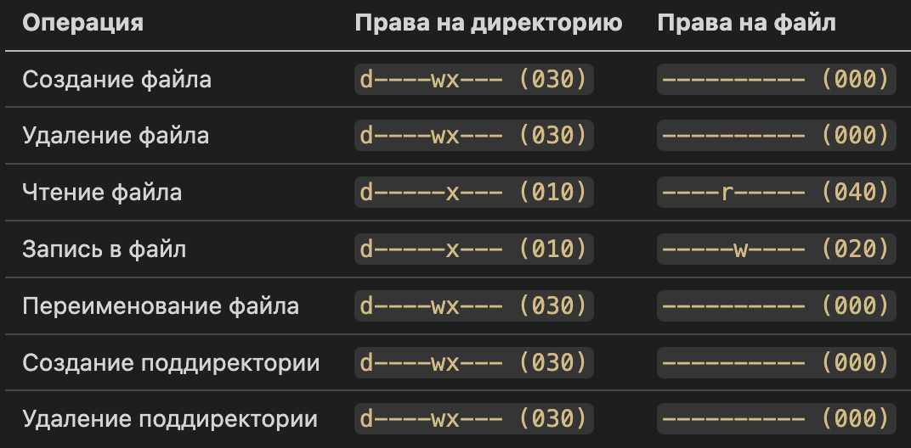{#fig:0012 width=50%}

Таблица 3.2 «Минимальные права для совершения операций от имени пользователей входящих в группу»

# Выводы

Были получены практические навыки работы в консоли с атрибутами файлов для групп пользователей

# Список литературы. Библиография

[0] Методические материалы курса

[1] Права доступа: https://codechick.io/tutorials/unix-linux/unix-linux-permissions

[2] Группы пользователей: https://losst.pro/gruppy-polzovatelej-linux#%D0%A7%D1%82%D0%BE_%D1%82%D0%B0%D0%BA%D0%BE%D0%B5_%D0%B3%D1%80%D1%83%D0%BF%D0%BF%D1%8B
