---
## Front matter
# Front matter
lang: ru-RU
title: "Лабораторная работа №4"
subtitle: "Дискреционное разграничение прав в Linux. Расширенные атрибуты"
author: " Кармацкий Н. С. Группа НФИбд-01-21 "
institute:
  - Российский университет дружбы народов, Москва, Россия
date: 7 Сентября 2024

## i18n babel
babel-lang: russian
babel-otherlangs: english

## Formatting pdf
toc: false
toc-title: Содержание
slide_level: 2
aspectratio: 169
section-titles: true
theme: metropolis
header-includes:
 - \metroset{progressbar=frametitle,sectionpage=progressbar,numbering=fraction}
 - '\makeatletter'
 - '\beamer@ignorenonframefalse'
 - '\makeatother'
---

## Цель работы

Получить практические навыки работы в консоли с атрибутами файлов для групп пользователей

## Теоретическое введение

**Права доступа** определяют, какие действия конкретный пользователь может или не может совершать с определенным файлами и каталогами. С помощью разрешений можно создать надежную среду — такую, в которой никто не может поменять содержимое ваших документов или повредить системные файлы. [1]

## Теоретическое введение

**Расширенные атрибуты файлов Linux** представляют собой пары имя:значение, которые постоянно связаны с файлами и каталогами, подобно тому как строки окружения связаны с процессом. Атрибут может быть определён или не определён. Если он определён, то его значение может быть или пустым, или не пустым. [2]

Расширенные атрибуты дополняют обычные атрибуты, которые связаны со всеми inode в файловой системе (т. е., данные stat(2)). Часто они используются для предоставления дополнительных возможностей файловой системы, например, дополнительные возможности безопасности, такие как списки контроля доступа (ACL), могут быть реализованы через расширенные атрибуты. [3]

# Выполнение лабораторной работы

## Определение арибутов файла

От имени пользователя guest, созданного в прошлых лабораторных работах, определяем атрибуты файла `/home/guest/dir1/file` (рис. 1)

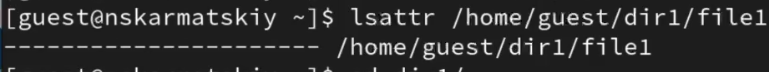{#fig:001 width=70%}

## Изменение прав доступа

Изменяем права доступа на этот файла с помощью chmod 600 (рис. 2)

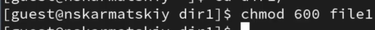{#fig:002 width=70%}

## Попытка установления атрибутов

Пробуем установить на файл `/home/guest/dir1/file` расширенный атрибут `a` от имени пользователя guest, в ответ получаем отказ от выполнения операции (рис. 3)

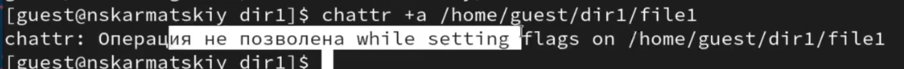{#fig:003 width=70%}

## Установка атрибутов

Устанавливаем расширенные права от имени суперпользователя, теперь нет проблемы с установкой расширенного атрибута (рис. 4)

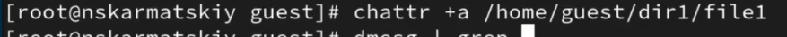{#fig:004 width=70%}

## Проверка атрибутов

От пользователя guest проверяем правильность установки атрибута (рис. 5)

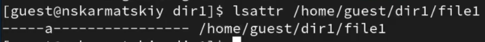{#fig:005 width=70%}

## Дозапись в файл

Выполним дозапись в файл `file1` слова `ф` командой `echo "test" /home/guest/dir1/file1`, далее проверяем что запись прошла успешно (рис. 6)

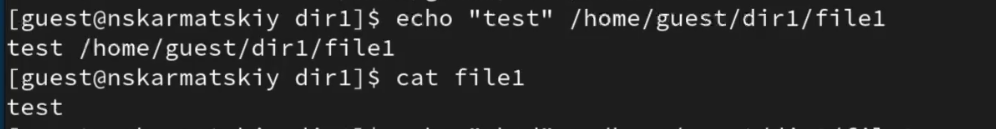{#fig:006 width=70%}

## Попытка перезаписи файлы

Пробуем удалить файл, получаем отказ от выполнения операции или перезаписать файл (рис. 7)

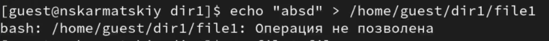{#fig:007 width=70%}

## Попытка переименования файла

Пробуем переименовать файл, получаем отказ от выполнения операции (рис. 8)

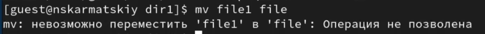{#fig:008 width=70%}

## Попытка изменить права доступа

Получаем отказ от выполнения при попытке установить другие права доступа (рис. 9)

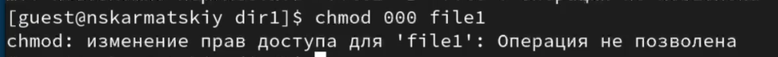{#fig:009 width=70%}

## Сянтие атрибутов файла

Снимаем расширенные атрибуты с файла командой `chattr -a /home/guest/dir1/file1` (рис. 10)

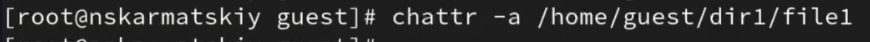{#fig:010 width=70%}

## Проверка выполнения неудавшихся действий

Проверяем ранее неудавшиеся операции, теперь все выолняется (рис. 11)

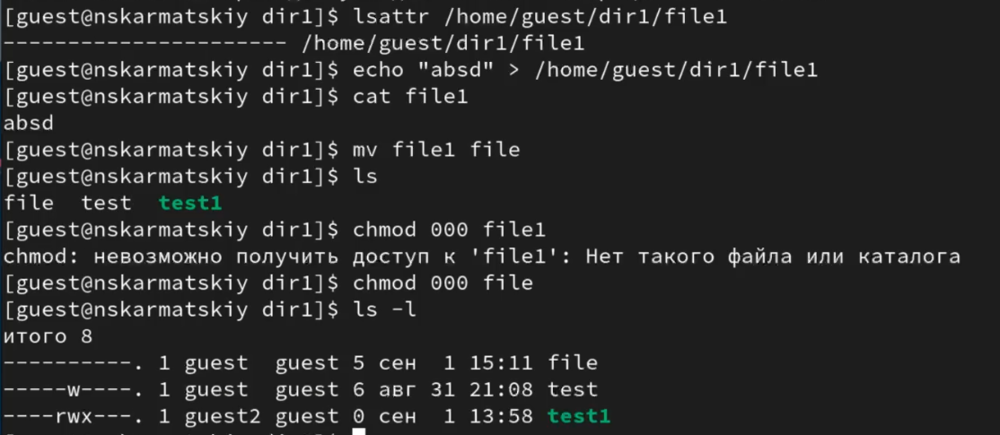{#fig:011 width=70%}

## Попытка добавить расширенный атрибут

Добавляем расширенный атрибут `i` от имени суперпользователя (рис. 12)

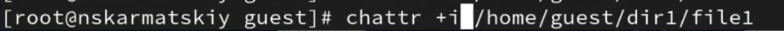{#fig:012 width=70%}

## Попытка добавить расширенный атрибут

Пытаемся записать в файл, дозаписать, переименовать или удалить, ничего из этого не получается сделать (рис. 13)

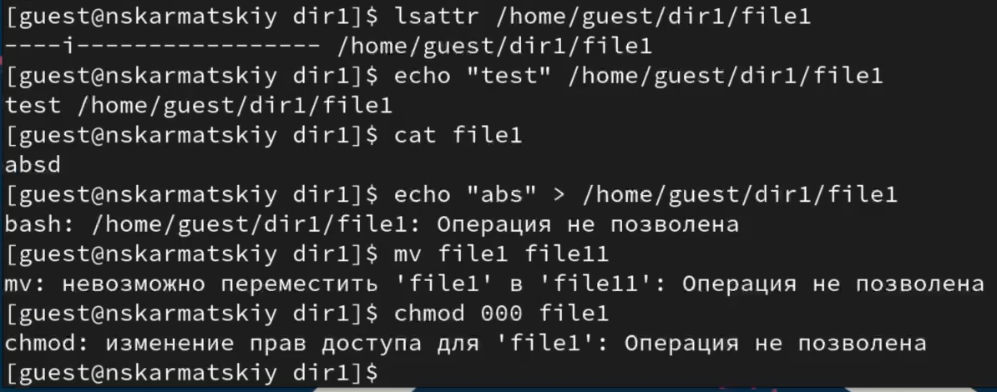{#fig:013 width=70%}

## Выводы

Были получены практические навыки работы в консоли с расширенными атрибутами файлов

## Список литературы. Библиография

[0] Методические материалы курса

[1] Права доступа: https://codechick.io/tutorials/unix-linux/unix-linux-permissions

[2] Расширенные атрибуты: https://ru.manpages.org/xattr/7

[3] Операции с расширенными атрибутами: https://p-n-z-8-8.livejournal.com/64493.html