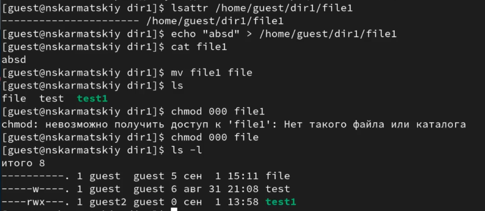
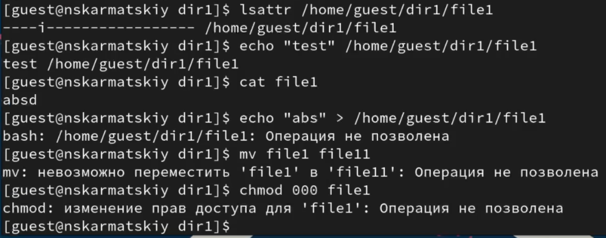

---
## Front matter
title: "Отчёта по лабораторной работе №4"
subtitle: "Дискреционное разграничение прав в Linux. Расширенные атрибуты"
author: "Кармацкий Никита Сергеевич"

## Generic otions
lang: ru-RU
toc-title: "Содержание"

## Bibliography
bibliography: bib/cite.bib
csl: pandoc/csl/gost-r-7-0-5-2008-numeric.csl

## Pdf output format
toc: true # Table of contents
toc-depth: 2
lof: true # List of figures
lot: true # List of tables
fontsize: 12pt
linestretch: 1.5
papersize: a4
documentclass: scrreprt
## I18n polyglossia
polyglossia-lang:
  name: russian
  options:
	- spelling=modern
	- babelshorthands=true
polyglossia-otherlangs:
  name: english
## I18n babel
babel-lang: russian
babel-otherlangs: english
## Fonts
mainfont: PT Serif
romanfont: PT Serif
sansfont: PT Sans
monofont: PT Mono
mainfontoptions: Ligatures=TeX
romanfontoptions: Ligatures=TeX
sansfontoptions: Ligatures=TeX,Scale=MatchLowercase
monofontoptions: Scale=MatchLowercase,Scale=0.9
## Biblatex
biblatex: true
biblio-style: "gost-numeric"
biblatexoptions:
  - parentracker=true
  - backend=biber
  - hyperref=auto
  - language=auto
  - autolang=other*
  - citestyle=gost-numeric
## Pandoc-crossref LaTeX customization
figureTitle: "Рис."
tableTitle: "Таблица"
listingTitle: "Листинг"
lofTitle: "Список иллюстраций"
lotTitle: "Список таблиц"
lolTitle: "Листинги"
## Misc options
indent: true
header-includes:
  - \usepackage{indentfirst}
  - \usepackage{float} # keep figures where there are in the text
  - \floatplacement{figure}{H} # keep figures where there are in the text
---

# Цель работы

Получение практических навыков работы в консоли с расширенными атрибутами файлов

# Теоретическое введение

**Права доступа** определяют, какие действия конкретный пользователь может или не может совершать с определенным файлами и каталогами. С помощью разрешений можно создать надежную среду — такую, в которой никто не может поменять содержимое ваших документов или повредить системные файлы. [1]

**Расширенные атрибуты файлов Linux** представляют собой пары имя:значение, которые постоянно связаны с файлами и каталогами, подобно тому как строки окружения связаны с процессом. Атрибут может быть определён или не определён. Если он определён, то его значение может быть или пустым, или не пустым. [2]

Расширенные атрибуты дополняют обычные атрибуты, которые связаны со всеми inode в файловой системе (т. е., данные stat(2)). Часто они используются для предоставления дополнительных возможностей файловой системы, например, дополнительные возможности безопасности, такие как списки контроля доступа (ACL), могут быть реализованы через расширенные атрибуты. [3]

*Установить атрибуты:*

- chattr filename

*Значения:*

- chattr +a # только добавление. Удаление и переименование запрещено;

- chattr +A # не фиксировать данные об обращении к файлу

- chattr +c # сжатый файл

- chattr +d # неархивируемый файл

- chattr +i # неизменяемый файл

- chattr +S # синхронное обновление

- chattr +s # безопасное удаление, (после удаления место на диске переписывается нулями)

- chattr +u # неудаляемый файл

- chattr -R # рекурсия

*Просмотреть атрибуты:*

- lsattr filename

*Опции:*

- lsattr -R # рекурсия

- lsattr -a # вывести все файлы (включая скрытые)

- lsattr -d # не выводить содержимое директории

# Выполнение лабораторной работы

1. От имени пользователя guest, созданного в прошлых лабораторных работах, определяем атрибуты файла `/home/guest/dir1/file` (рис. 1)

{#fig:001 width=70%}

2. Изменяем права доступа на этот файла с помощью chmod 600 (рис. 2)

{#fig:002 width=70%}

3. Пробуем установить на файл `/home/guest/dir1/file` расширенный атрибут `a` от имени пользователя guest, в ответ получаем отказ от выполнения операции (рис. 3)

{#fig:003 width=70%}

4. Устанавливаем расширенные права от имени суперпользователя, теперь нет проблемы с установкой расширенного атрибута (рис. 4)

{#fig:004 width=70%}

5. От пользователя guest проверяем правильность установки атрибута (рис. 5)

{#fig:005 width=70%}

6. Выполним дозапись в файл `file1` слова `ф` командой `echo "test" /home/guest/dir1/file1`, далее проверяем что запись прошла успешно (рис. 6)

{#fig:006 width=70%}

7. Пробуем удалить файл, получаем отказ от выполнения операции или перезаписать файл (рис. 7)

{#fig:007 width=70%}

Пробуем переименовать файл, получаем отказ от выполнения операции (рис. 8)

{#fig:008 width=70%}

8. Получаем отказ от выполнения при попытке установить другие права доступа (рис. 9)

{#fig:009 width=70%}

9. Снимаем расширенные атрибуты с файла командой `chattr -a /home/guest/dir1/file1` (рис. 10)

{#fig:010 width=70%}

Проверяем ранее неудавшиеся операции, теперь все выолняется (рис. 11)

{#fig:011 width=70%}

10. Добавляем расширенный атрибут `i` от имени суперпользователя (рис. 12)

{#fig:012 width=70%}

Пытаемся записать в файл, дозаписать, переименовать или удалить, ничего из этого не получается сделать (рис. 13)

{#fig:013 width=70%}

# Выводы

Были получены практические навыки работы в консоли с расширенными атрибутами файлов

# Список литературы. Библиография

[0] Методические материалы курса

[1] Права доступа: https://codechick.io/tutorials/unix-linux/unix-linux-permissions

[2] Расширенные атрибуты: https://ru.manpages.org/xattr/7

[3] Операции с расширенными атрибутами: https://p-n-z-8-8.livejournal.com/64493.html