---
## Front matter
# Front matter
lang: ru-RU
title: "Лабораторная работа №5"
subtitle: "Дискреционное разграничение прав в Linux. Исследование влияния дополнительных атрибутов"
author: " Кармацкий Н. С. Группа НФИбд-01-21 "
institute:
  - Российский университет дружбы народов, Москва, Россия
date: 29 Сентября 2024

## i18n babel
babel-lang: russian
babel-otherlangs: english

## Formatting pdf
toc: false
toc-title: Содержание
slide_level: 2
aspectratio: 169
section-titles: true
theme: metropolis
header-includes:
 - \metroset{progressbar=frametitle,sectionpage=progressbar,numbering=fraction}
 - '\makeatletter'
 - '\beamer@ignorenonframefalse'
 - '\makeatother'
---

## Цель работы

Изучение механизмов изменения идентификаторов, применения SetUID- и Sticky-битов. Получение практических навыков работы в консоли с дополнительными атрибутами. Рассмотрение работы механизма смены идентификатора процессов пользователей, а также влияние бита Sticky на запись и удаление файлов

## Теоретическое введение 1

*SetUID (SUID)*
SetUID — это бит, который позволяет пользователям запускать исполняемые файлы с правами владельца этого файла. Это означает, что если файл имеет установленный бит SUID, любой пользователь, запускающий этот файл, будет выполнять его с привилегиями владельца файла, а не с привилегиями своего собственного пользователя. Это часто используется для программ, требующих повышенных прав, например, команда passwd, которая позволяет пользователям изменять свои пароли.

## Теоретическое введение 2

*Sticky-бит*
Sticky-бит — это бит, который устанавливается на каталоги и ограничивает возможность удаления файлов в этом каталоге. Если Sticky-бит установлен на каталог, только владелец файла или суперпользователь может удалить или переименовать файлы в этом каталоге. Это полезно для общих каталогов, таких как /tmp, где множество пользователей могут создавать файлы.

# Выполнение лабораторной работы

## Проверка компилятора

1. Проверяем наличие компилятора языка C (рис. 1)

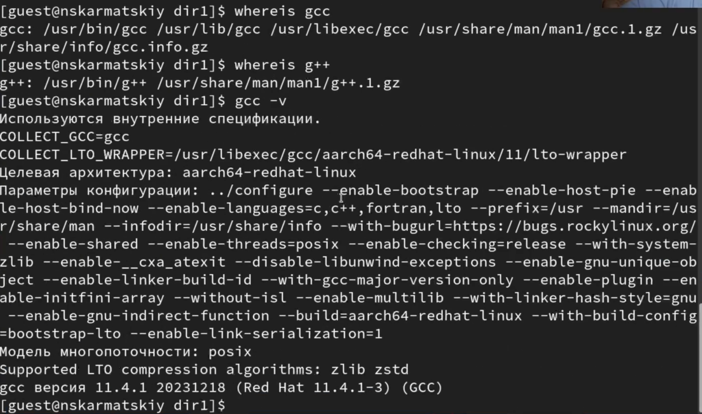{#fig:001 width=45%}

## Создание программы 1

2. Создаем отдельный каталог для программ, а так же файл с 1 первой программой (рис. 2)

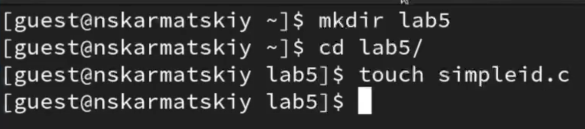{#fig:002 width=45%}

## Создание программы 2

3. Заполнение файла (рис. 3)

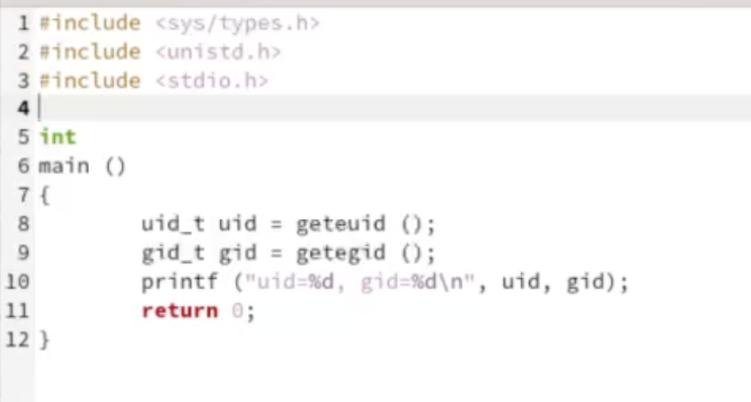{#fig:003 width=45%}

## Создание программы 3

4. Компилируем и выполняем программу, а так же выполним системуню программму id. В результате получем из нашей программы те же данные, что и из id, но только в более коротком варианте (рис. 4)

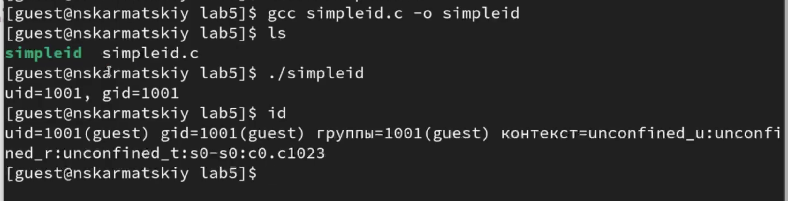{#fig:004 width=45%}

## Создание программы 4

5. Усложняем программу, добавив вывод действительных идентификторов, так же назовем ее simpleid2 (рис. 5)

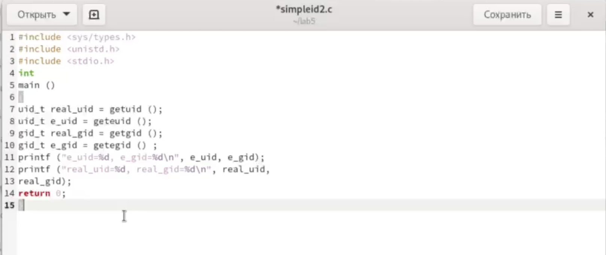{#fig:005 width=45%}

## Создание программы 5

6. Компилируем новую програаму и получаем дополнительные сведения в отличии от первоначальной программы (рис. 6)

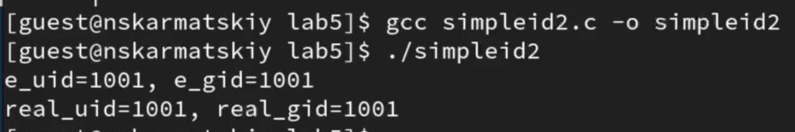{#fig:006 width=45%}

## Изменение прав доступа 1

7. С помощью chown изменяю владельца файла на суперпользователя, с помощью chmod изменяю права доступа (рис. 7)

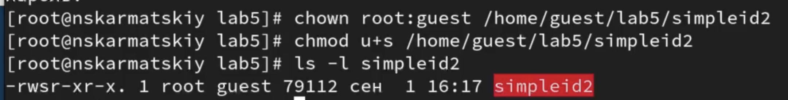{#fig:007 width=45%}

Далее запускаем программу получаем все значения равными 0, так как выполняем все от прав суперпользователя

## Изменение прав доступа 2

8. Пробуем сменить атрибуты относительно SetGID-бита, получаем все точно тоже самое (рис. 8)

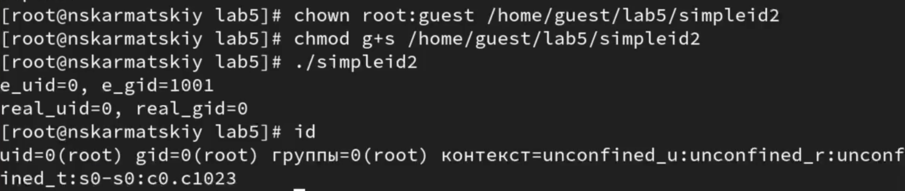{#fig:008 width=45%}

## Создание новой программы 1

9. Создадим программу readfile.c, которая будет читать файлы. Откпомпилируем ее, а так же поменяем владельца у файла и изменим права так, чтобы только суперпользователь мог прочитать его, а guest не мог (рис. 10)

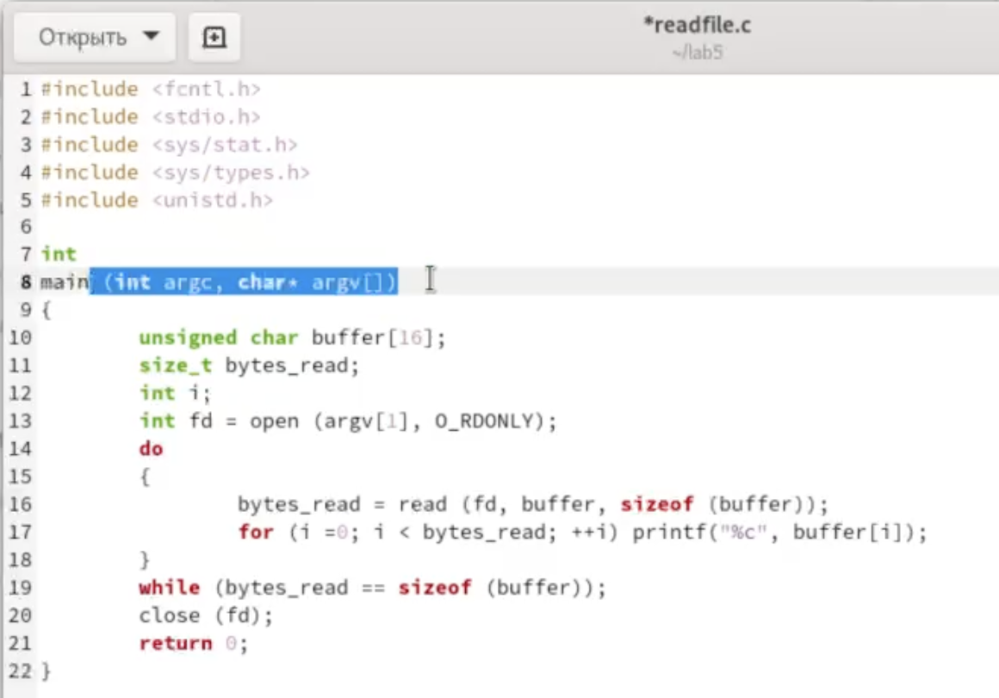{#fig:009 width=45%}

## Создание новой программы 2

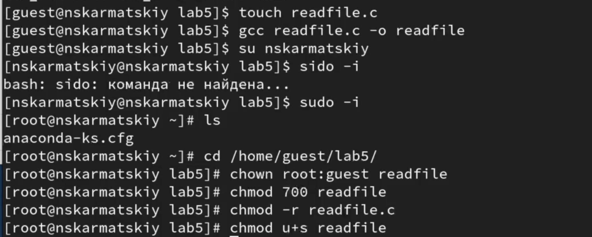{#fig:010 width=45%}

## Проверка работоспобности программы с новыми правами 1

10. Проверка новых прав доступа для guest, как видим ничего не получается сделать (рис. 11)

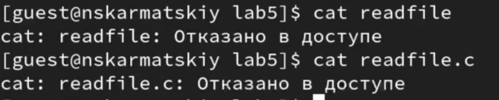{#fig:011 width=45%}

## Проверка работоспобности программы с новыми правами 2

пытаемся считать файл с помошью программмы, но получае отказ в доступе (рис. 12)

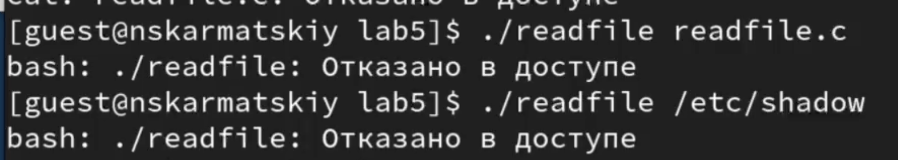{#fig:012 width=45%}

Мы запретили всем, кроме суперпользователя испольнять или читать файл, поэтому никто и не может выполнить никакое действие с файлом

## Исследование Sticky-бита 1

11. Выясним ,установлен ли атрибут Sticky на директории /tmp. От имени пользователя guest создаем файл file01.txt с тестом `text` в каталоге /tmp. Так же просмотрим артирубы файла и разрешим чтение и запись для категории пользователей "все остальные" (рис. 13)

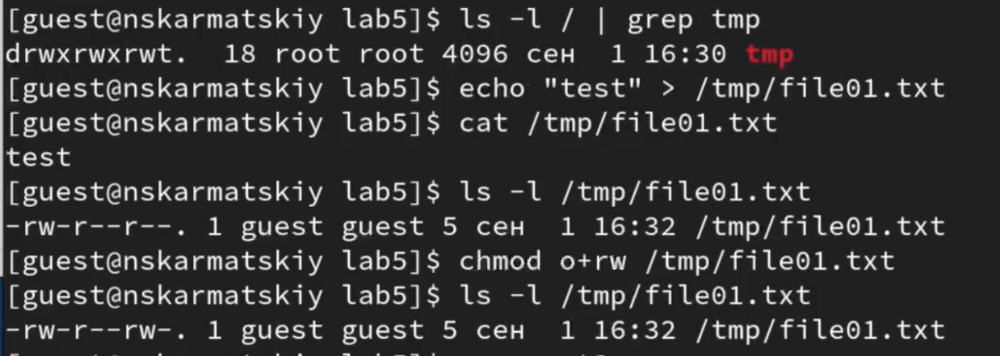{#fig:013 width=45%}

## Исследование Sticky-бита 2

12. Попробуем прочитать, записать и удалить файл от имени пользователя guest2. Получаем отказ в доступе везде, кроме чтения файла (рис. 14)

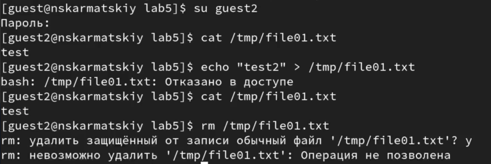{#fig:014 width=45%}

## Исследование Sticky-бита 3

13. Снимем атрибут Sticky с директории /tmp  и повторим действия, описанные в пункте 12. (рис. 15)

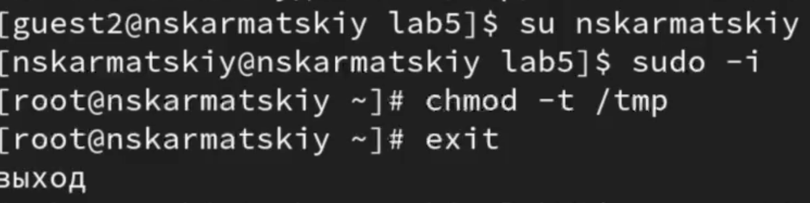{#fig:015 width=45%}

## Исследование Sticky-бита 4

Попробуем снова выполнить все те же действия. Получаем доступ к файлу от guest2 (рис. 16)

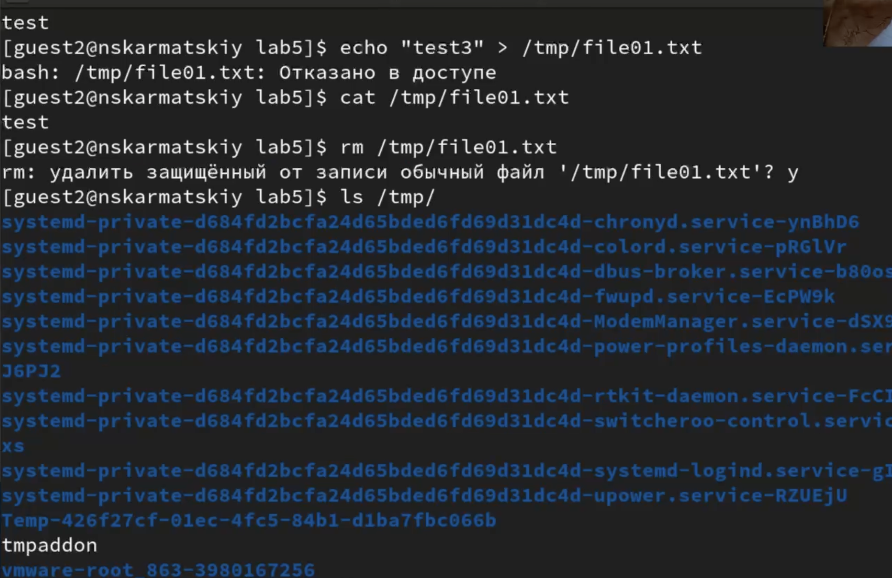{#fig:016 width=45%}

## Исследование Sticky-бита 5

14. Вернем первоначальные атрибуты директории /tmp(рис. 17)

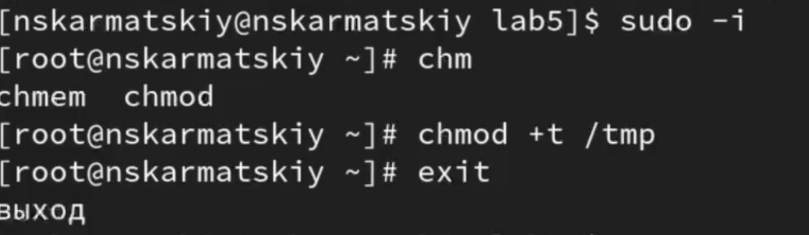{#fig:017 width=45%}

## Выводы

Изучили механизмы изменения идентификаторов, применения SetUID- и Sticky-битов. Полученили практическик навыкои работы в консоли с дополнительными атрибутами. Рассмотрели работу механизма смены идентификатора процессов пользователей, а также влияние бита Sticky на запись и удаление файлов
