---
## Front matter
title: "Отчёта по лабораторной работе №5"
subtitle: "Дискреционное разграничение прав в Linux. Исследование влияния дополнительных атрибутов"
author: "Кармацкий Никита Сергеевич"

## Generic otions
lang: ru-RU
toc-title: "Содержание"

## Bibliography
bibliography: bib/cite.bib
csl: pandoc/csl/gost-r-7-0-5-2008-numeric.csl

## Pdf output format
toc: true # Table of contents
toc-depth: 2
lof: true # List of figures
lot: true # List of tables
fontsize: 12pt
linestretch: 1.5
papersize: a4
documentclass: scrreprt
## I18n polyglossia
polyglossia-lang:
  name: russian
  options:
	- spelling=modern
	- babelshorthands=true
polyglossia-otherlangs:
  name: english
## I18n babel
babel-lang: russian
babel-otherlangs: english
## Fonts
mainfont: PT Serif
romanfont: PT Serif
sansfont: PT Sans
monofont: PT Mono
mainfontoptions: Ligatures=TeX
romanfontoptions: Ligatures=TeX
sansfontoptions: Ligatures=TeX,Scale=MatchLowercase
monofontoptions: Scale=MatchLowercase,Scale=0.9
## Biblatex
biblatex: true
biblio-style: "gost-numeric"
biblatexoptions:
  - parentracker=true
  - backend=biber
  - hyperref=auto
  - language=auto
  - autolang=other*
  - citestyle=gost-numeric
## Pandoc-crossref LaTeX customization
figureTitle: "Рис."
tableTitle: "Таблица"
listingTitle: "Листинг"
lofTitle: "Список иллюстраций"
lotTitle: "Список таблиц"
lolTitle: "Листинги"
## Misc options
indent: true
header-includes:
  - \usepackage{indentfirst}
  - \usepackage{float} # keep figures where there are in the text
  - \floatplacement{figure}{H} # keep figures where there are in the text
---

# Цель работы

Изучение механизмов изменения идентификаторов, применения SetUID- и Sticky-битов. Получение практических навыков работы в консоли с дополнительными атрибутами. Рассмотрение работы механизма смены идентификатора процессов пользователей, а также влияние бита Sticky на запись и удаление файлов

# Теоретическое введение

*SetUID (SUID)*
SetUID — это бит, который позволяет пользователям запускать исполняемые файлы с правами владельца этого файла. Это означает, что если файл имеет установленный бит SUID, любой пользователь, запускающий этот файл, будет выполнять его с привилегиями владельца файла, а не с привилегиями своего собственного пользователя. Это часто используется для программ, требующих повышенных прав, например, команда passwd, которая позволяет пользователям изменять свои пароли.

*Sticky-бит*
Sticky-бит — это бит, который устанавливается на каталоги и ограничивает возможность удаления файлов в этом каталоге. Если Sticky-бит установлен на каталог, только владелец файла или суперпользователь может удалить или переименовать файлы в этом каталоге. Это полезно для общих каталогов, таких как /tmp, где множество пользователей могут создавать файлы.

# Выполнение лабораторной работы

1. Проверяем наличие компилятора языка C (рис. 1)

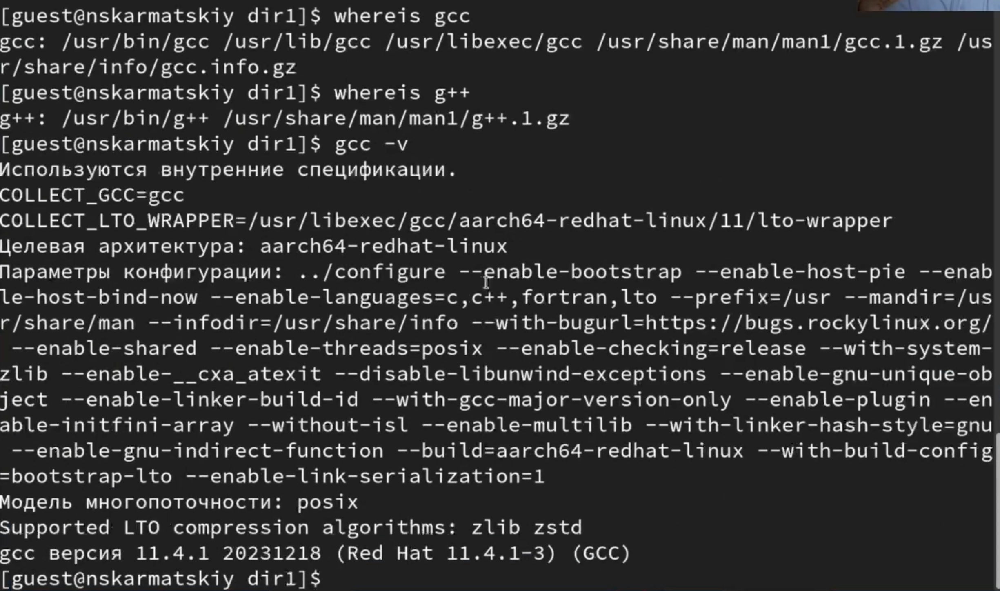{#fig:001 width=70%}

## Создание программы

2. Создаем отдельный каталог для программ, а так же файл с 1 первой программой (рис. 2)

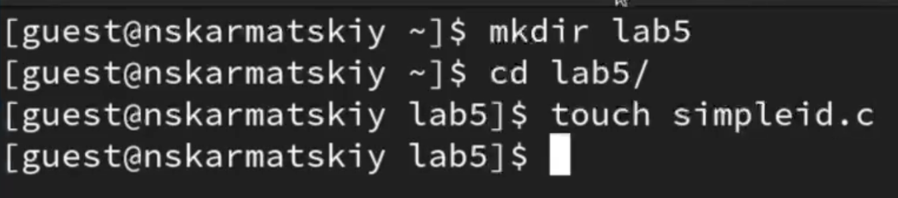{#fig:002 width=70%}

3. Заполнение файла (рис. 3)

{#fig:003 width=70%}

Листинг:
```
#include <sys/types.h>
#include <unistd.h>
#include <stdio.h>
int
main ()
{
uid_t uid = geteuid ();
gid_t gid = getegid ();
printf ("uid=%d, gid=%d\n", uid, gid);
return 0;
}
```

4. Уопмилируем и выполняем программу, а так же выполним системуню программму id. В результате получем из нашей программы те же данные, что и из id, но только в более коротком варианте (рис. 4)

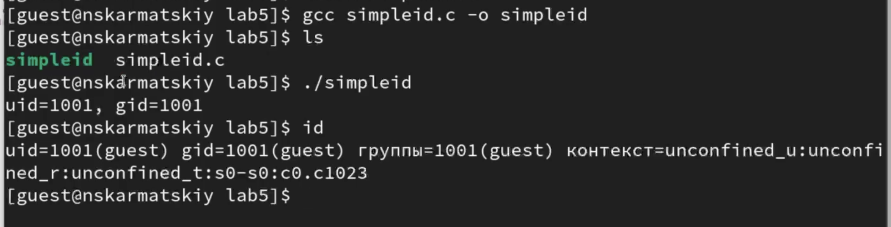{#fig:004 width=70%}

5. Усложняем программу, добавив вывод действительных идентификторов, так же назовем ее simpleid2 (рис. 5)

{#fig:005 width=70%}

6. Компилируем новую програаму и получаем дополнительные сведения в отличии от первоначальной программы (рис. 6)

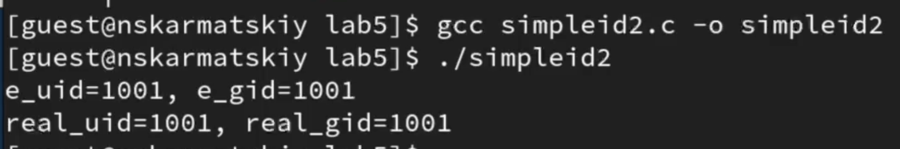{#fig:006 width=70%}

7. С помощью chown изменяю владельца файла на суперпользователя, с помощью chmod изменяю права доступа (рис. 7)

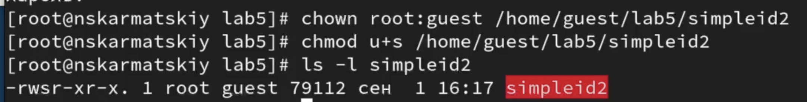{#fig:007 width=70%}

Далее запускаем программу получаем все значения равными 0, так как выполняем все от прав суперпользователя

8. Пробуем сменить отрибуты относительно SetGID-бита, получаем все точно тоже самое (рис. 8)

{#fig:008 width=70%}

9. Создадим программу readfile.c, которая будет читать файлы. Откпомпилируем ее, а так же поменяем владельца у файла и изменим права так, чтобы только суперпользователь мог прочитать его, а guest не мог (рис. 10)

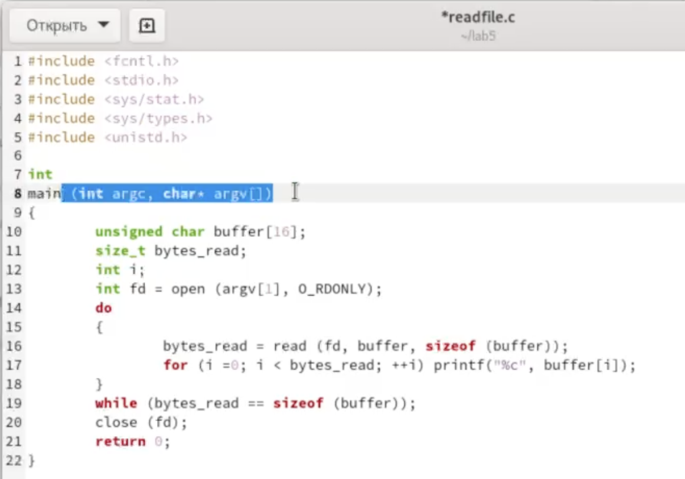{#fig:009 width=70%}

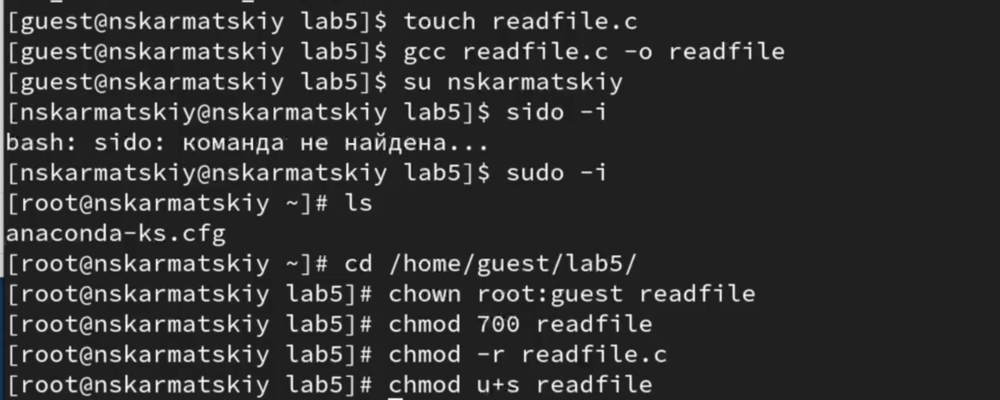{#fig:010 width=70%}


10. Проверка новых прав доступа для guest, как видим ничего не получается сделать (рис. 11)

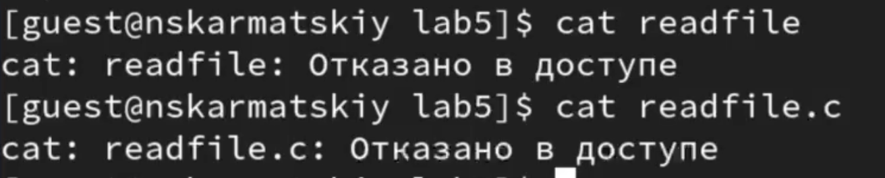{#fig:011 width=70%}

пытаемся считать файл с помошью программмы, но получае отказ в доступе (рис. 12)

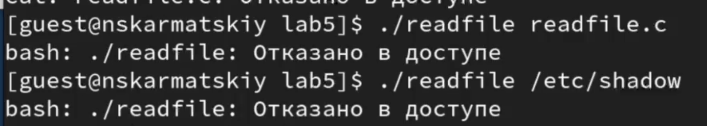{#fig:012 width=70%}

Мы запретили всем, кроме суперпользователя испольнять или чиатть файл, поэтому никто и не может выполнить никакое действие с файлом


## Исследование Sticky-бита

11. Выясним ,установлен ли атрибут Sticky на директории /tmp. От имени пользователя guest создаем файл file01.txt с тестом `text` в каталоге /tmp. Так же просмотрим артирубы файла и разрешим чтение и запись для категории пользователей "все остальные" (рис. 13)

{#fig:013 width=70%}

12. Попробуем прочитать, записать и удалить файл от имени пользователя guest2. Получаем отказ в доступе везде, кроме чтения файла (рис. 14)

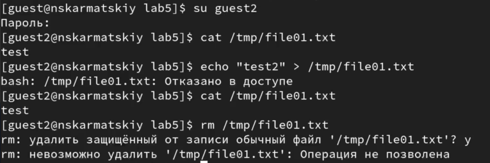{#fig:014 width=70%}

13. Снимем атрибут Sticky с директории /tmp  и повторим действия, описанные в пункте 12. (рис. 15)

{#fig:015 width=70%}

Попробуем снова выполнить все те же действия. Получаем доступ к файлу от guest2 (рис. 16)

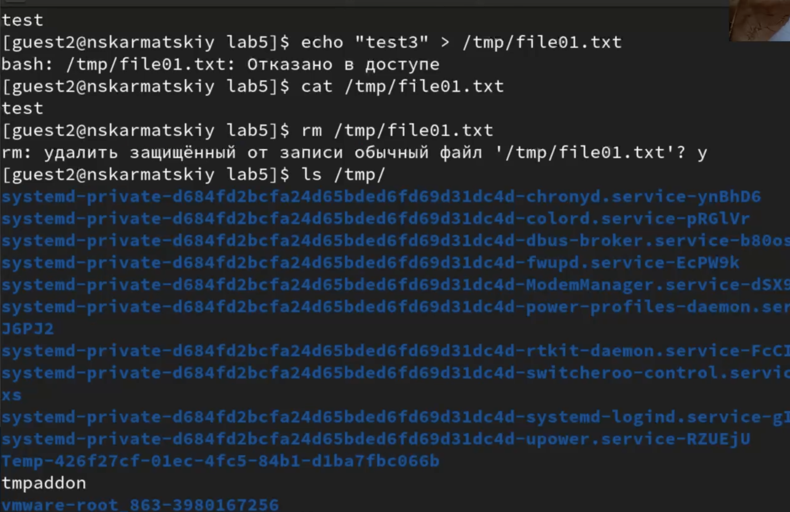{#fig:016 width=70%}

14. Вернем первоначальные атрибуты директории /tmp(рис. 17)

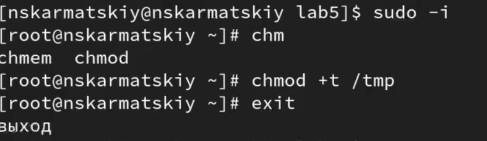{#fig:017 width=70%}

# Выводы

Изучили механизмы изменения идентификаторов, применения SetUID- и Sticky-битов. Полученили практическик навыкои работы в консоли с дополнительными атрибутами. Рассмотрели работу механизма смены идентификатора процессов пользователей, а также влияние бита Sticky на запись и удаление файлов