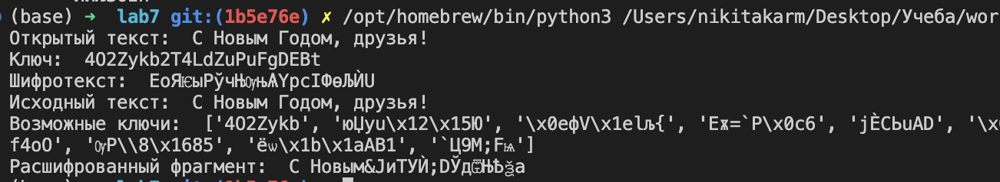

---
## Front matter
# Front matter
lang: ru-RU
title: "Лабораторная работа №7"
subtitle: "Элементы криптографии. Однократное гаммирование"
author: " Кармацкий Н. С. Группа НФИбд-01-21 "
institute:
  - Российский университет дружбы народов, Москва, Россия
date: 29 Сентября 2024

## i18n babel
babel-lang: russian
babel-otherlangs: english

## Formatting pdf
toc: false
toc-title: Содержание
slide_level: 2
aspectratio: 169
section-titles: true
theme: metropolis
header-includes:
 - \metroset{progressbar=frametitle,sectionpage=progressbar,numbering=fraction}
 - '\makeatletter'
 - '\beamer@ignorenonframefalse'
 - '\makeatother'
---

# Цель работы

Освоить на практике применение режима однократного гаммирования

# Задание

Нужно подобрать ключ, чтобы получить сообщение «С Новым Годом, друзья!». Требуется разработать приложение, позволяющее шифровать и дешифровать данные в режиме однократного гаммирования. Приложение должно:

1. Определить вид шифротекста при известном ключе и известном открытом тексте.
2. Определить ключ, с помощью которого шифротекст может быть преобразован в некоторый фрагмент текста, представляющий собой один из возможных вариантов прочтения открытого текста

# Теоретическое введение

Предложенная Г. С. Вернамом так называемая «схема однократного использования (гаммирования)» является простой, но надёжной схемой шифрования данных.

**Гаммирование** представляет собой наложение (снятие) на открытые (зашифрованные) данные последовательности элементов других данных, полученной с помощью некоторого криптографического алгоритма, для получения зашифрованных (открытых) данных. Иными словами, наложение гаммы — это сложение её элементов с элементами открытого (закрытого) текста по некоторому фиксированному модулю, значение которого представляет собой известную часть алгоритма шифрования.

В соответствии с теорией криптоанализа, если в методе шифрования используется однократная вероятностная гамма (однократное гаммирование) той же длины, что и подлежащий сокрытию текст, то текст нельзя раскрыть. Даже при раскрытии части последовательности гаммы нельзя получить информацию о всём скрываемом тексте.

# Выполнение лабораторной работы

Мы выполняли лабораторную работу на языке программирования Python, листинг программы и результаты выполнения приведены в отчете

# 1 часть выполнения

Требуется разработать программу, позволяющее шифровать и дешифровать данные в режиме однократного гаммирования. Для начала напишем функцию для генерации случайного ключа

Листинг функции:

```python
  def generate_key_hex(text):
    key = ''
    for i in range(len(text)):
        key += random.choice(string.ascii_letters + string.digits) #генерация цифры для каждого символа в тексте
    return key
```

# 2 часть выполнения

Необходимо определить тип шифротекста при известном ключе и известном открытом тексте. Так как операция исключающего или отменяет сама себя, делаем функцию и для расшифровки и для дешифровки текста

Листинг функции:

```python
def en_de_crypt(text, key):
    new_text = ''
    for i in range(len(text)): #проход по каждому символу в тексте
        new_text += chr(ord(text[i]) ^ ord(key[i % len(key)]))
    return new_text
```

# 3 часть выполнения

Необходимо определить тип ключа, с помощью которого шифротекст может быть преобразован в некоторые фрагменты текста, представляющие собой один из возможных вариантов прочтения открытого текста. Для этого создаем функцию для нахождения возможных ключей для фрагмента текста

Листинг функции:

```python
def find_possible_key(text, fragment):
    possible_keys = []
    for i in range(len(text) - len(fragment) + 1):
        possible_key = ""
        for j in range(len(fragment)):
            possible_key += chr(ord(text[i + j]) ^ ord(fragment[j]))
        possible_keys.append(possible_key)
    return possible_keys
```

# 4 часть выполнения

Запускаем программу и получем положительные результаты выполнеия алгоритма (рис. [-@fig:001]).

{#fig:001 width=70%}

# Выводы

Мы освоили на практике применение режима однократного гаммирования
