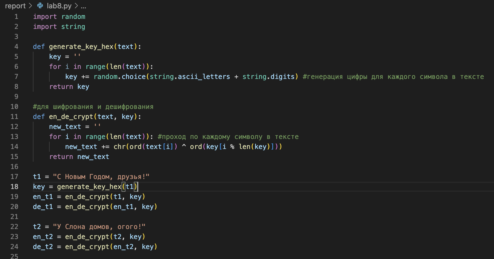
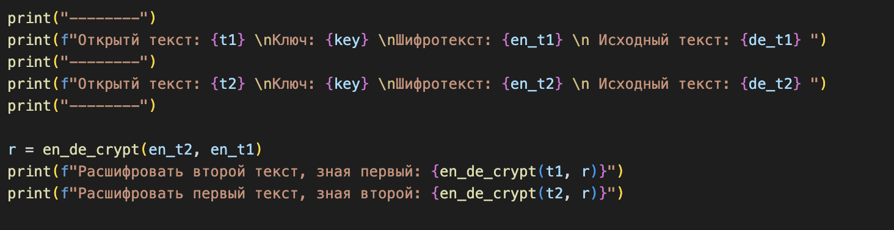
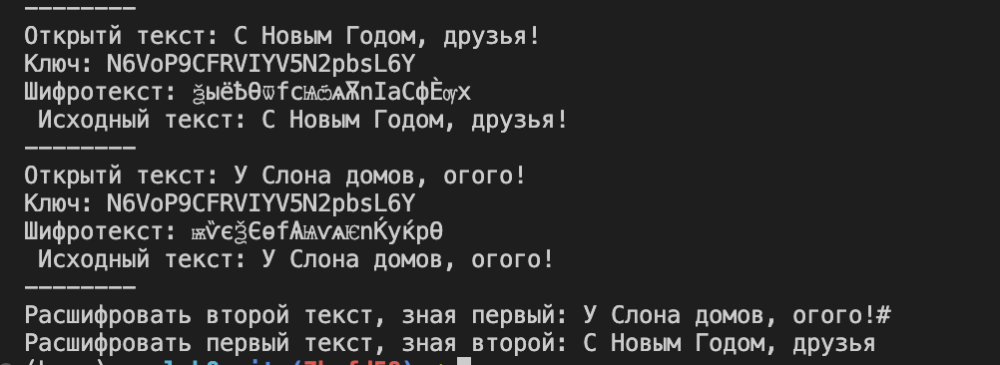

---
## Front matter
# Front matter
lang: ru-RU
title: "Лабораторная работа №8"
subtitle: "Элементы криптографии. Шифрование(кодирование) различных исходных текстов одним ключом"
author: " Кармацкий Н. С. Группа НФИбд-01-21 "
institute:
  - Российский университет дружбы народов, Москва, Россия
date: 29 Сентября 2024

## i18n babel
babel-lang: russian
babel-otherlangs: english

## Formatting pdf
toc: false
toc-title: Содержание
slide_level: 2
aspectratio: 169
section-titles: true
theme: metropolis
header-includes:
 - \metroset{progressbar=frametitle,sectionpage=progressbar,numbering=fraction}
 - '\makeatletter'
 - '\beamer@ignorenonframefalse'
 - '\makeatother'
---

# Цель работы

Освоить на практике применение режима однократного гаммирования на примере кодирования различных исходных текстов одним ключом

# Задание

Два текста кодируются одним ключом (однократное гаммирование).
Требуется не зная ключа и не стремясь его определить, прочитать оба текста. Необходимо разработать приложение, позволяющее шифровать и дешифровать тексты $P_1$ и $P_2$ в режиме однократного гаммирования. Приложение должно определить вид шифротекстов $C_1$ и $C_2$ обоих текстов $P_1$ и P2 при известном ключе; Необходимо определить и выразить аналитически способ, при котором злоумышленник может прочитать оба текста, не зная ключа и не стремясь его определить.

# Выполнение лабораторной работы

Мы выполняли лабораторную работу на языке программирования Python, используя функции из 7 лабораторной работы листинг программы и результаты выполнения приведены в отчете

# 1 часть выполнения

Используя функцию для генерации ключа, генерирую ключ, затем шифрую два разных текста одним и тем же ключом (рис. [-@fig:001]).

{#fig:001 width=50%}

# 2 часть выполнения

Расшифровываем оба текста сначала с помощью одного ключа, затем мы предполагаем, что нам не известен ключ, но известен один из текстов и уже расшифровываем неизвестный, зная шифротексты и первый текст  (рис. [-@fig:002])

{#fig:002 width=60%}

# 3 часть выполнения

Запускаем программу и получем положительные результаты выполнеия алгоритма (рис. [-@fig:003]).

{#fig:003 width=70%}

# Выводы

В ходе лабораторной работы были освоины на практике навыки применения режима однократного гаммирования на примере кодирования различных исходных текстов одним ключом.
