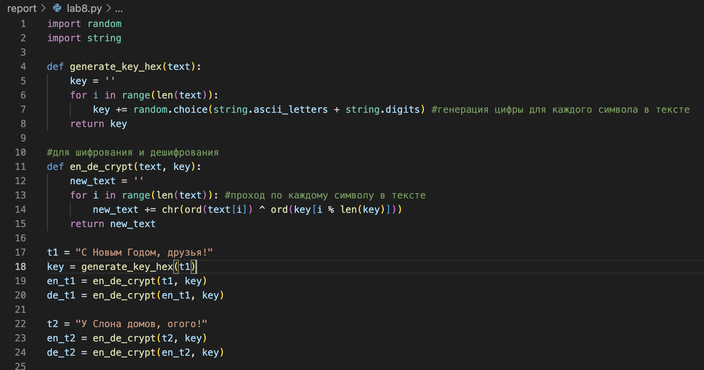

---
## Front matter
title: "Отчёта по лабораторной работе №8"
subtitle: "Элементы криптографии. Шифрование(кодирование) различных исходных текстов одним ключом"
author: "Кармацкий Никита Сергеевич"

## Generic otions
lang: ru-RU
toc-title: "Содержание"

## Bibliography
bibliography: bib/cite.bib
csl: pandoc/csl/gost-r-7-0-5-2008-numeric.csl

## Pdf output format
toc: true # Table of contents
toc-depth: 2
lof: true # List of figures
lot: true # List of tables
fontsize: 12pt
linestretch: 1.5
papersize: a4
documentclass: scrreprt
## I18n polyglossia
polyglossia-lang:
  name: russian
  options:
	- spelling=modern
	- babelshorthands=true
polyglossia-otherlangs:
  name: english
## I18n babel
babel-lang: russian
babel-otherlangs: english
## Fonts
mainfont: PT Serif
romanfont: PT Serif
sansfont: PT Sans
monofont: PT Mono
mainfontoptions: Ligatures=TeX
romanfontoptions: Ligatures=TeX
sansfontoptions: Ligatures=TeX,Scale=MatchLowercase
monofontoptions: Scale=MatchLowercase,Scale=0.9
## Biblatex
biblatex: true
biblio-style: "gost-numeric"
biblatexoptions:
  - parentracker=true
  - backend=biber
  - hyperref=auto
  - language=auto
  - autolang=other*
  - citestyle=gost-numeric
## Pandoc-crossref LaTeX customization
figureTitle: "Рис."
tableTitle: "Таблица"
listingTitle: "Листинг"
lofTitle: "Список иллюстраций"
lolTitle: "Листинги"
## Misc options
indent: true
header-includes:
  - \usepackage{amsmath}
  - \usepackage{amssymb}
  - \usepackage{unicode-math}
  - \setmathfont{Libertinus Math} # или TeX Gyre Pagella Math для математических символов
  - \usepackage{float} # keep figures where they are in the text
  - \floatplacement{figure}{H} # keep figures where they are in the text
---

# Цель работы

Освоить на практике применение режима однократного гаммирования на примере кодирования различных исходных текстов одним ключом

# Задание

Два текста кодируются одним ключом (однократное гаммирование).
Требуется не зная ключа и не стремясь его определить, прочитать оба текста. Необходимо разработать приложение, позволяющее шифровать и дешифровать тексты $P_1$ и $P_2$ в режиме однократного гаммирования. Приложение должно определить вид шифротекстов $C_1$ и $C_2$ обоих текстов $P_1$ и P2 при известном ключе; Необходимо определить и выразить аналитически способ, при котором злоумышленник может прочитать оба текста, не зная ключа и не стремясь его определить.

# Теоретическое введение

Исходные данные.

Две телеграммы Центра:

$P_1$ = НаВашисходящийот1204

$P_2$ = ВСеверныйфилиалБанка

Ключ Центра длиной 20 байт:
K = 05 0C 17 7F 0E 4E 37 D2 94 10 09 2E 22 57 FF C8 OB B2 70 54

Шифротексты обеих телеграмм можно получить по формулам режима
однократного гаммирования:

$C_1 = P_1 ⊕ K$,

$C_2$ = P_2 ⊕ K$. (8.1)

Открытый текст можно найти, зная шифротекст двух телеграмм, зашифрованных одним ключом. Для это оба равенства (8.1) складываются по модулю 2. Тогда с учётом свойства операции XOR

$$1 ⊕ 1 = 0, 1 ⊕ 0 = 1 (8.2)$$

получаем:

$$C_1 ⊕ C_2 = P_1 ⊕ K ⊕ P_2 ⊕ K = P1 ⊕ P_2.$$

Предположим, что одна из телеграмм является шаблоном — т.е. имеет текст фиксированный формат, в который вписываются значения полей.
Допустим, что злоумышленнику этот формат известен. Тогда он получает
достаточно много пар $C_1 ⊕ C_2$ (известен вид обеих шифровок). Тогда зная
$P_1$ и учитывая (8.2), имеем:

$C_1 ⊕ C_2 ⊕ P_1 = P_1 ⊕ P_2 ⊕ P_1 = P_2. (8.3)$

Таким образом, злоумышленник получает возможность определить те
символы сообщения $P_2$, которые находятся на позициях известного шаблона сообщения $P_1$. В соответствии с логикой сообщения $P_2$, злоумышленник имеет реальный шанс узнать ещё некоторое количество символов сообщения $P_2$. Затем вновь используется (8.3) с подстановкой вместо P1 полученных на предыдущем шаге новых символов сообщения $P_2$. И так далее.
Действуя подобным образом, злоумышленник даже если не прочитает оба
сообщения, то значительно уменьшит пространство их поиска

# Выполнение лабораторной работы

Мы выполняли лабораторную работу на языке программирования Python, используя функции из 7 лабораторной работы листинг программы и результаты выполнения приведены в отчете

1. Используя функцию для генерации ключа, генерирую ключ, затем шифрую два разных текста одним и тем же ключом (рис. [-@fig:001]).

{#fig:001 width=70%}

2. Расшифровываем оба текста сначала с помощью одного ключа, затем мы предполагаем, что нам не известен ключ, но известен один из текстов и уже расшифровываем неизвестный, зная шифротексты и первый текст  (рис. [-@fig:002])

{#fig:002 width=70%}

3. Запускаем программу и получем положительные результаты выполнеия алгоритма (рис. [-@fig:003]).

Листинг всей программы:

```python
import random
import string

def generate_key_hex(text):
    key = ''
    for i in range(len(text)):
        key += random.choice(string.ascii_letters + string.digits) #генерация цифры для каждого символа в тексте
    return key

#для шифрования и дешифрования
def en_de_crypt(text, key):
    new_text = ''
    for i in range(len(text)): #проход по каждому символу в тексте
        new_text += chr(ord(text[i]) ^ ord(key[i % len(key)]))
    return new_text

t1 = "С Новым Годом, друзья!"
key = generate_key_hex(t1)
en_t1 = en_de_crypt(t1, key)
de_t1 = en_de_crypt(en_t1, key)

t2 = "У Слона домов, огого!"
en_t2 = en_de_crypt(t2, key)
de_t2 = en_de_crypt(en_t2, key)

print("--------")
print(f"Открытй текст: {t1} \nКлюч: {key} \nШифротекст: {en_t1} \n Исходный текст: {de_t1} ")
print("--------")
print(f"Открытй текст: {t2} \nКлюч: {key} \nШифротекст: {en_t2} \n Исходный текст: {de_t2} ")
print("--------")

r = en_de_crypt(en_t2, en_t1)
print(f"Расшифровать второй текст, зная первый: {en_de_crypt(t1, r)}")
print(f"Расшифровать первый текст, зная второй: {en_de_crypt(t2, r)}")
```

{#fig:003 width=70%}

# Выводы

В ходе лабораторной работы были освоины на практике навыки применения режима однократного гаммирования на примере кодирования различных исходных текстов одним ключом.

# Ответы на контрольные вопросы

1. Как, зная один из текстов ($P_1$ или $P_2$), определить другой, не зная при
этом ключа? - Для определения другого текста ($P_2$) можно просто взять зашифрованные тексты $C_1 ⊕ C_2$, далее применить XOR к ним и к известному тексту: $C_1 ⊕ C_2 ⊕ P_1 = P_2$.

2. Что будет при повторном использовании ключа при шифровании текста? - При повторном использовании ключа мы получим дешифрованный текст.

3. Как реализуется режим шифрования однократного гаммирования одним ключом двух открытых текстов? - Режим шифрования однократного гаммирования одним ключом двух открытых текстов осуществляется путем XOR-ирования каждого бита первого текста с соответствующим битом ключа или второго текста.

4. Перечислите недостатки шифрования одним ключом двух открытых текстов - Недостатки шифрования одним ключом двух открытых текстов включают возможность раскрытия ключа или текстов при известном открытом тексте.

5. Перечислите преимущества шифрования одним ключом двух открытых текстов - Преимущества шифрования одним ключом двух открытых текстов включают использование одного ключа для зашифрования нескольких сообщений без необходимости создания нового ключа и выделения на него памяти.

