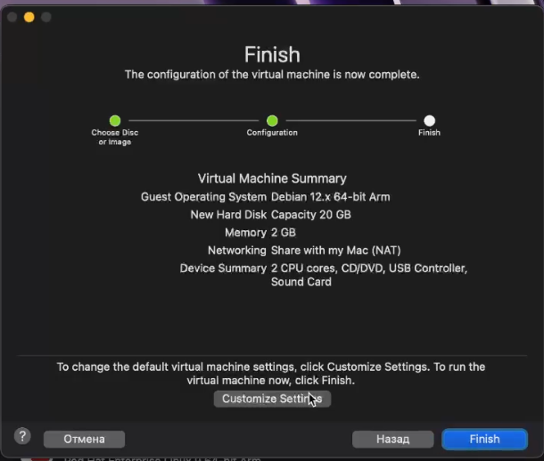
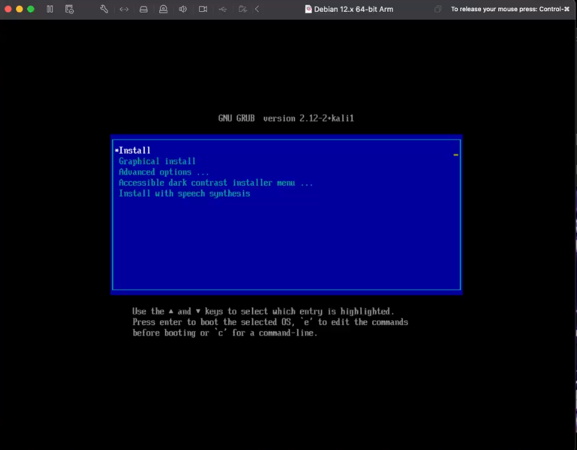
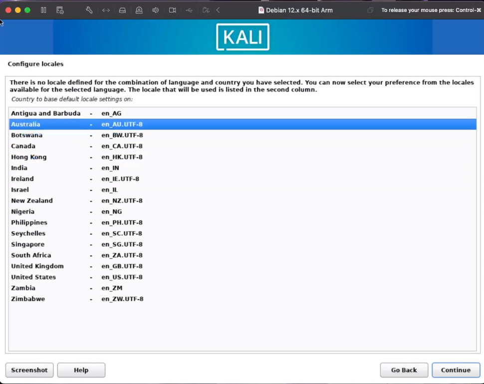
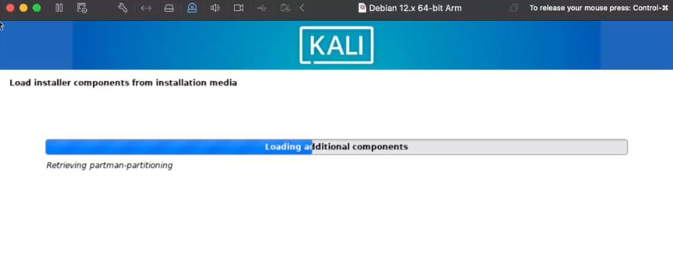
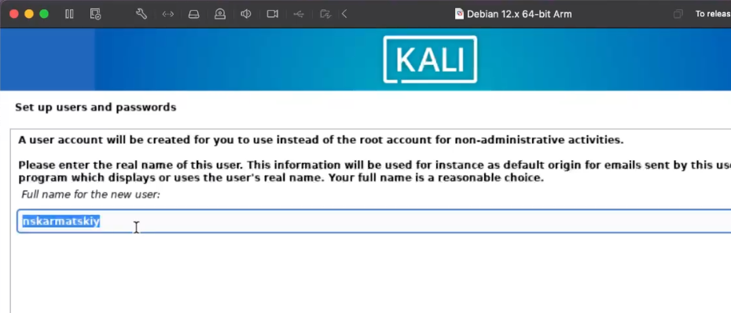
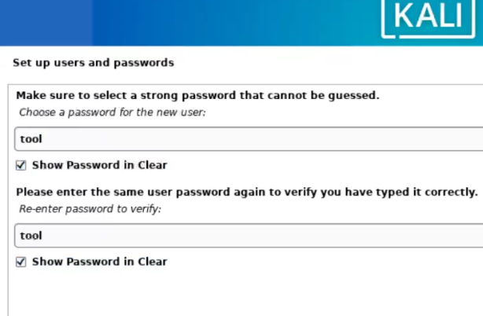
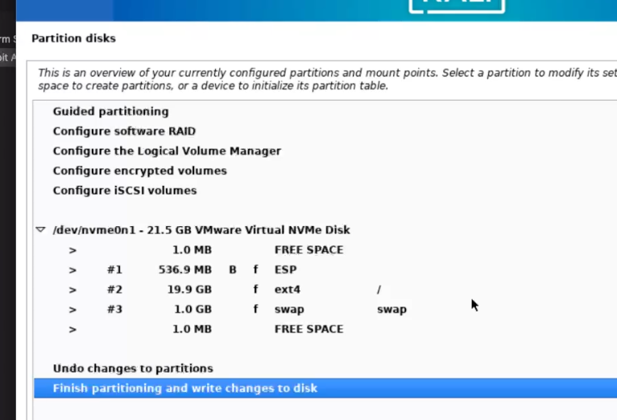
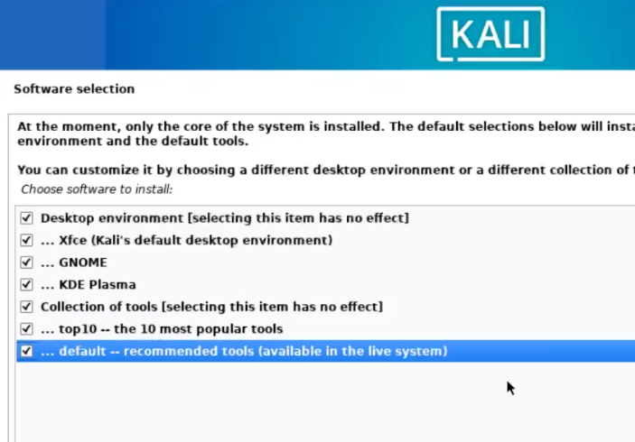
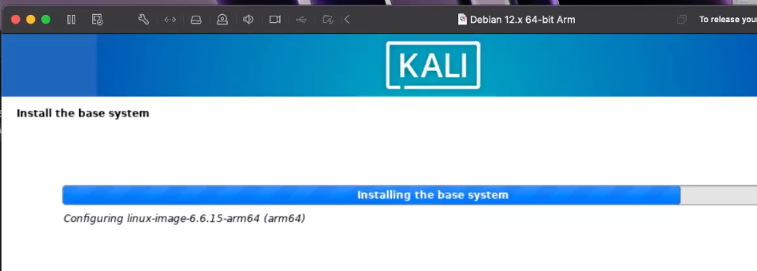
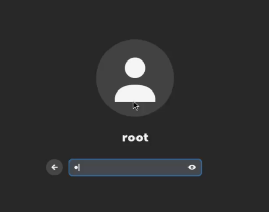

---
## Front matter
# Front matter
lang: ru-RU
title: "Индивидуальный проект №1"
subtitle: "Установка и конфигурация операционной системы на виртуальную машину"
author: " Кармацкий Н. С. Группа НФИбд-01-21 "
institute:
  - Российский университет дружбы народов, Москва, Россия
date: 13 Сентября 2024

## i18n babel
babel-lang: russian
babel-otherlangs: english

## Formatting pdf
toc: false
toc-title: Содержание
slide_level: 2
aspectratio: 169
section-titles: true
theme: metropolis
header-includes:
 - \metroset{progressbar=frametitle,sectionpage=progressbar,numbering=fraction}
 - '\makeatletter'
 - '\beamer@ignorenonframefalse'
 - '\makeatother'
---

# Цель работы

Установка ОС на Virtual Box(в нашем случае на VMware Fusion) для дальнейшего использования в ходе прохождения курса.

# Задание

1. Установить ОС на VMware Fusion.

# Теоретическое введение

Виртуальная машина (VM, от англ. virtual machine) — программная и/или аппаратная система, эмулирующая аппаратное обеспечение некоторой платформы (guest — гостевая платформа) и исполняющая программы для guest-платформы на host-платформе (host — хост-платформа, платформа-хозяин) или виртуализирующая некоторую платформу и создающая на ней среды, изолирующие друг от друга программы и даже операционные системы; также спецификация некоторой вычислительной среды. [2]

**VMware Fusion**  — гипервизор, позволяющий в среде macOS на базе платформы Intel и AppleSilicon создавать и запускать виртуальные машины, предоставляющие возможность запускать приложения, разработанные для других операционных систем, в том числе Windows и Linux. Поддерживаются как 32-разрядные, так и 64-разрядные версии ОС.

# Выполнение лабораторной работы

Предварительно были скачаны Virtual Box (и установлена) и дистрибутив Kali.

Создаем новую виртуальную машину и настариваем.

# Настройка VM. Часть 1.

{ #fig:001 width=60% height=60% }

# Настройка VM. Часть 2.

{ #fig:002 width=60% height=60% }

# Запуск VM. 

{ #fig:003 width=60% height=60% }

# Настройки ОС. Часть 1.

{ #fig:004 width=60% height=60% }

# Настройки ОС. Часть 2.

{ #fig:005 width=60% height=60% }

# Настройки ОС. Часть 3.

{ #fig:006 width=60% height=60% }

# Настройки ОС. Часть 4.

{ #fig:007 width=60% height=60% }

# Настройки ОС. Часть 5.

{ #fig:008 width=60% height=60% }

# Настройки ОС. Часть 6.

{ #fig:009 width=60% height=60% }

# Запуск виртуальной машины и вход в систему

1. Перезагружаем виртуальную машину после установки и входим под своей учетной записью. 

{ #fig:010 width=60% height=60% }

# Вывод

В ходе выполнения индивидуального проекта была установлена новая ОС на новую виртуальную машину. 

# Библиография

1. Методические материалы курса.
2. Wikipedia: Виртуальная машина. (https://ru.wikipedia.org/wiki/%D0%92%D0%B8%D1%80%D1%82%D1%83%D0%B0%D0%BB%D1%8C%D0%BD%D0%B0%D1%8F_%D0%BC%D0%B0%D1%88%D0%B8%D0%BD%D0%B0)
3. Документация по VMware Fusion: https://www.vmware.com/products/desktop-hypervisor/workstation-and-fusion
