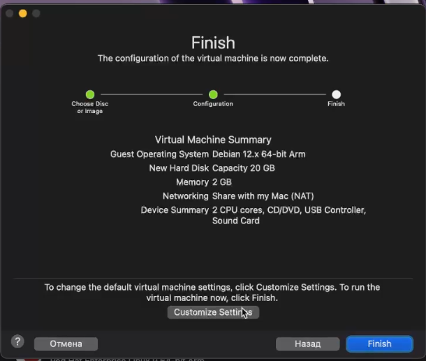
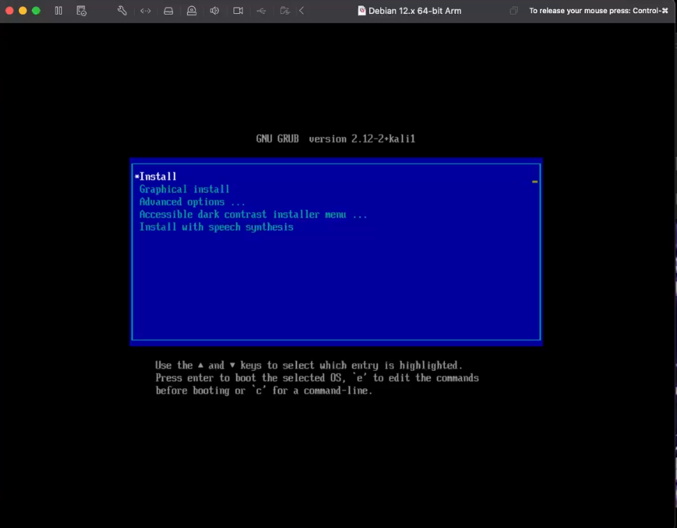
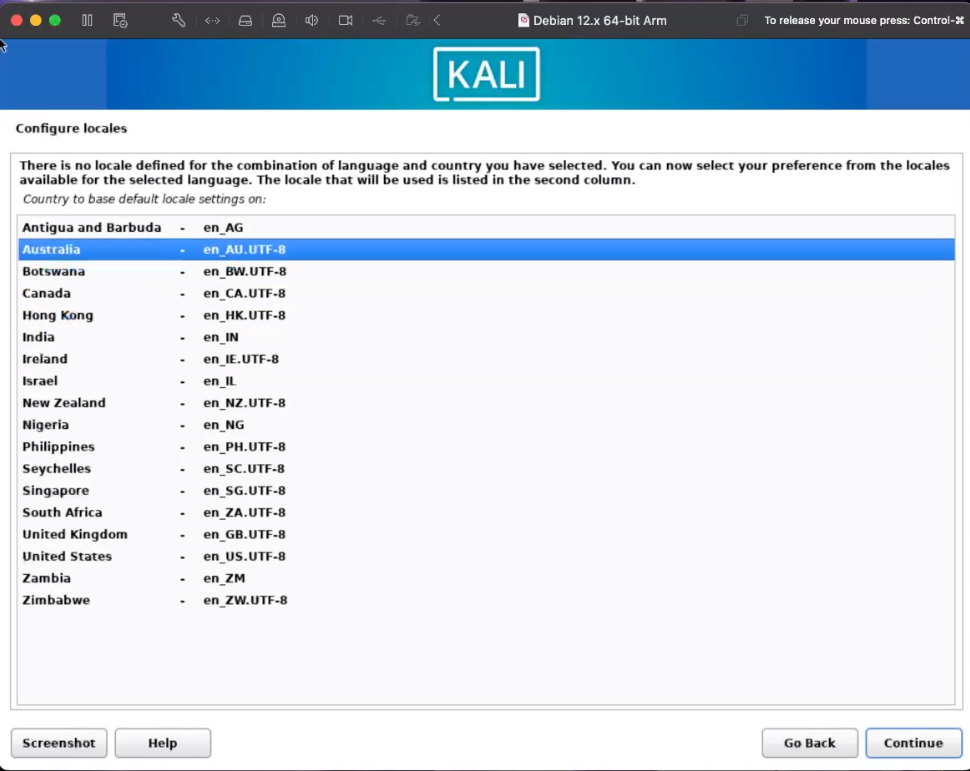
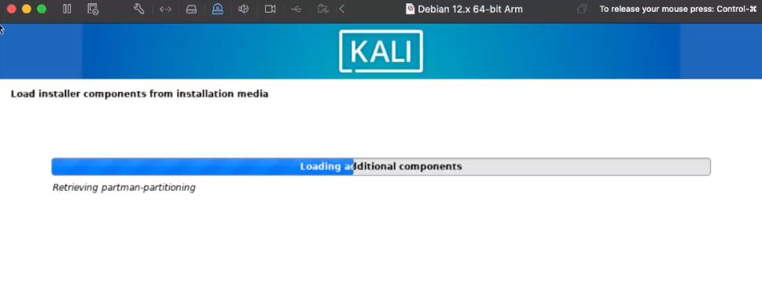
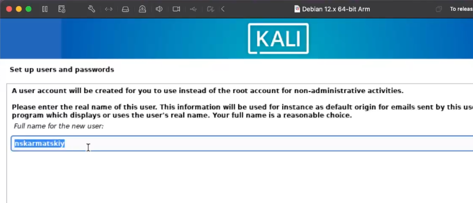
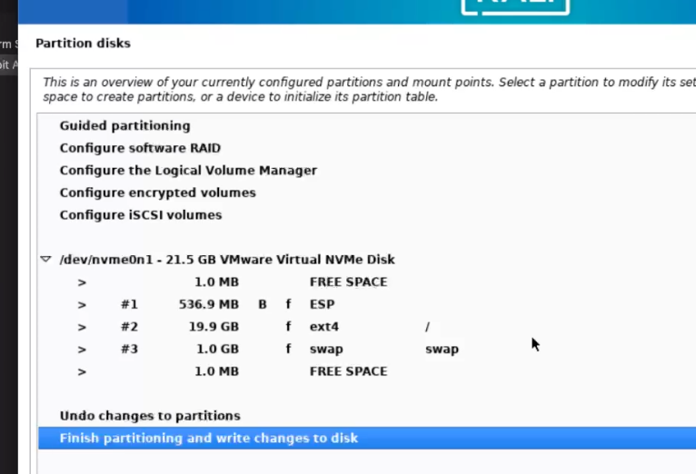
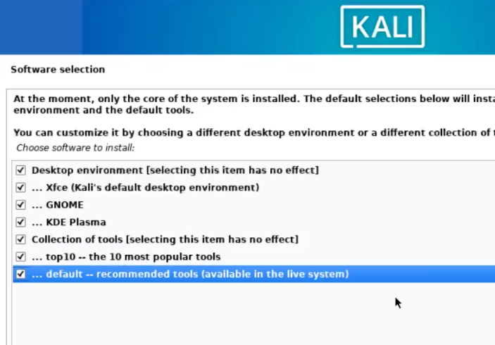
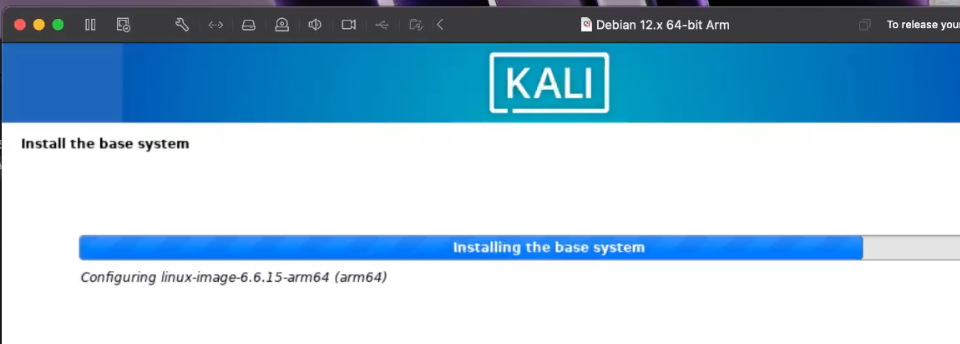
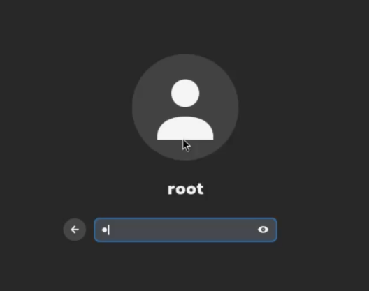

---
## Front matter
title: "Отчёт по Индивидуальному проекту №1 Информационная безопасность"
subtitle: "Настройка рабочего пространства и конфигурация операционной системы на виртуальную машину."
author: "Кармацкий Никита Сергеевич, 
НФИбд-01-21, 1032210061"

babel-lang: russian 
babel-otherlangs: english 
mainfont: Arial 
monofont: Courier New 
fontsize: 9pt

## Generic otions
lang: ru-RU
toc-title: "Содержание"

## Bibliography
bibliography: bib/cite.bib
csl: pandoc/csl/gost-r-7-0-5-2008-numeric.csl

## Pdf output format
toc: true # Table of contents
toc-depth: 2
lof: true # List of figures
fontsize: 9pt
linestretch: 1.5
papersize: a4
documentclass: scrreprt
## I16n polyglossia
polyglossia-lang:
  name: russian
  options:
  - spelling=modern
  - babelshorthands=true
polyglossia-otherlangs:
  name: english
## I16n babel
babel-lang: russian
babel-otherlangs: english
## Fonts
mainfont: PT Serif
romanfont: PT Serif
sansfont: PT Sans
monofont: PT Mono
mainfontoptions: Ligatures=TeX
romanfontoptions: Ligatures=TeX
sansfontoptions: Ligatures=TeX,Scale=MatchLowercase
monofontoptions: Scale=MatchLowercase,Scale=0.6
## Biblatex
biblatex: true
biblio-style: "gost-numeric"
biblatexoptions:
  - parentracker=true
  - backend=biber
  - hyperref=auto
  - language=auto
  - autolang=other*
  - citestyle=gost-numeric
## Pandoc-crossref LaTeX customization
figureTitle: "Рис."
tableTitle: "Таблица"
listingTitle: "Листинг"
lofTitle: "Список иллюстраций"
lolTitle: "Листинги"
## Misc options
indent: true
header-includes:
  - \usepackage{indentfirst}
  - \usepackage{float} # keep figures where there are in the text
  - \floatplacement{figure}{H} # keep figures where there are in the text
---

# Цель работы

Настроить рабочее пространство для индивидуального проекта, и настройка минимально необходимых для дальнейшей работы сервисов.

# Теоретическое введение

**Oracle VM VirtualBox** — это мощная и бесплатная виртуализационная платформа, разработанная корпорацией Oracle, которая позволяет пользователям создавать и управлять виртуальными машинами на своих компьютерах. [1]

**VMware Fusion**  — гипервизор, позволяющий в среде macOS на базе платформы Intel и AppleSilicon создавать и запускать виртуальные машины, предоставляющие возможность запускать приложения, разработанные для других операционных систем, в том числе Windows и Linux. Поддерживаются как 32-разрядные, так и 64-разрядные версии ОС.

# Выполнение лабораторной работы

## Установка и конфигурация операционной системы на виртуальную машину

### VMware Fusion

Выбор этого гипервизоры был основан на том факте, что VirtualBox до сих пор Beta на процессарах *M* серии от Apple и не хочет устанавливать и создавать машины.

{ #fig:001 width=100% height=100% }

{ #fig:002 width=100% height=100% }

{ #fig:003 width=100% height=100% }

{ #fig:004 width=100% height=100% }

{ #fig:005 width=100% height=100% }

{ #fig:006 width=100% height=100% }

{ #fig:007 width=100% height=100% }

{ #fig:008 width=100% height=100% }

{ #fig:009 width=100% height=100% }

### Переход в ОС Linux

{ #fig:010 width=100% height=100% }

# Вывод

Были настроено рабочее пространство для индивидуальных работ, настроено минимальный набор необходимых для дальнейшей работы сервисов.

# Список литературы. Библиография

[1] Документация по Virtual Box: https://www.virtualbox.org/wiki/Documentation

[2] Документация по VMware Fusion: https://www.vmware.com/products/desktop-hypervisor/workstation-and-fusion
