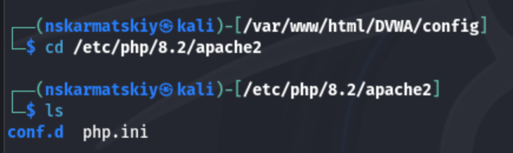

---
# Front matter
# Front matter
lang: ru-RU
title: "Индивидуальный проект"
subtitle: "Этап 2"
author: " Кармацкий Н. С. Группа НФИбд-01-21 "
institute:
  - Российский университет дружбы народов, Москва, Россия
date: 7 Сентября 2024

# i18n babel
babel-lang: russian
babel-otherlangs: english

# Formatting pdf
toc: false
toc-title: Содержание
slide_level: 2
aspectratio: 169
section-titles: true
theme: metropolis
header-includes:
 - \metroset{progressbar=frametitle,sectionpage=progressbar,numbering=fraction}
 - '\makeatletter'
 - '\beamer@ignorenonframefalse'
 - '\makeatother'
---

# Цель работы

Приобретение практических навыков по установке DVWA.

# Задание

1. Установить DVWA на дистрибутив Kali Linux.

# Теоретическое введение

DVWA - это уязвимое веб-приложение, разработанное на PHP и MYSQL.

Некоторые из уязвимостей веб приложений, который содержит DVWA:
- Брутфорс: Брутфорс HTTP формы страницы входа - используется для тестирования инструментов по атаке на пароль методом грубой силы и показывает небезопасность слабых паролей.
- Исполнение (внедрение) команд: Выполнение команд уровня операционной системы.
- Межсайтовая подделка запроса (CSRF): Позволяет «атакующему» изменить пароль администратора приложений.
- Внедрение (инклуд) файлов: Позволяет «атакующему» присоединить удалённые/локальные файлы в веб приложение.
- SQL внедрение: Позволяет «атакующему» внедрить SQL выражения в HTTP из поля ввода, DVWA включает слепое и основанное на ошибке SQL внедрение.
- Небезопасная выгрузка файлов: Позволяет «атакующему» выгрузить вредоносные файлы на веб сервер.
- Межсайтовый скриптинг (XSS): «Атакующий» может внедрить свои скрипты в веб приложение/базу данных. DVWA включает отражённую и хранимую XSS.
- Пасхальные яйца: раскрытие полных путей, обход аутентификации и некоторые другие.

DVWA имеет четыре уровня безопасности, они меняют уровень безопасности каждого веб приложения в DVWA:
- Невозможный — этот уровень должен быть безопасным от всех уязвимостей. Он используется для сравнения уязвимого исходного кода с безопасным исходным кодом.
- Высокий — это расширение среднего уровня сложности, со смесью более сложных или альтернативных плохих практик в попытке обезопасить код. Уязвимости не позволяют такой простор эксплуатации как на других уровнях.
- Средний — этот уровень безопасности предназначен главным образом для того, чтобы дать пользователю пример плохих практик безопасности, где разработчик попытался сделать приложение безопасным, но потерпел неудачу.
- Низкий — этот уровень безопасности совершенно уязвим и совсем не имеет защиты. Его предназначение быть примером среди уязвимых веб приложений, примером плохих практик 

# Выполнение лабораторной работы

# 1.1

Настройка DVWA происходит на нашем локальном хосте, поэтому нужно перейти в директорию `/var/www/html`. Затем клонирую нужный репозиторий GitHub (рис. 1).

{#fig:001 width=45%}

# 1.2

Проверяем, что файлы скопировалтсб правильно, далее повышаем права доступа к этому каталогу до 777 (рис. 2).

{#fig:002 width=45%}

# 1.3

Чтобы настроить DVWA, нужно перейти в каталог `/dvwa/config`, затем нужно отредактировать файл `config/config.inc.php`, который мы получаем копируя шаблон (рис. 3).

{#fig:003 width=45%}

# 1.4

Открываем файл на редактирование и меняем имя пользователя и пароль (рис. 4).

{#fig:004 width=45%}

# 2.1

Запускаем сервис sql и проверяем, что он запущен. (рис. 5).

{#fig:005 width=45%}

# 2.2

Авторизируемся в базе данных MariaDB под именем пользователя, которого мы задали в файле `config.inc.php`, а так же представляем привелегии для работы с этой базой данных (рис. 6).

{#fig:006 width=45%}

# 3.1

Далее настраиваем серев apache2, для этого переходим в каталог с настройками(рис. 7).

{#fig:007 width=45%}

# 3.1

Открываем файл `apache2.conf`. В файле параметры allow_url_fopen и allow_url_include должны быть поставлены как `On` (рис. 8)

{#fig:008 width=45%}

# 3.3

Запускаем сервис apache2 и проверяем, что он запущен (рис. 9).

{#fig:009 width=45%}

# 4.1

Мы настроили DVWA, Apache и базу данных, поэтому открываем браузер и запускаем веб-приложение, введя 127.0.0.1/DVWA (рис. 10)

{#fig:010 width=45%}

# 4.2

Прокручиваем страницу вниз и нажимaем на кнопку `create\reset database` (рис. 11)

{#fig:011 width=45%}

# 4.3

Авторизуюемся с помощью предложенных по умолчанию данных(admin:password) (рис. 12)

{#fig:012 width=45%}

# 4.4

Оказываемся на домшней странице веб-приложения, на этом установка окончена (рис. 13)

{#fig:013 width=45%}

# Выводы

Приобрели практические навыки по установке уязвимого веб-приложения DVWA.