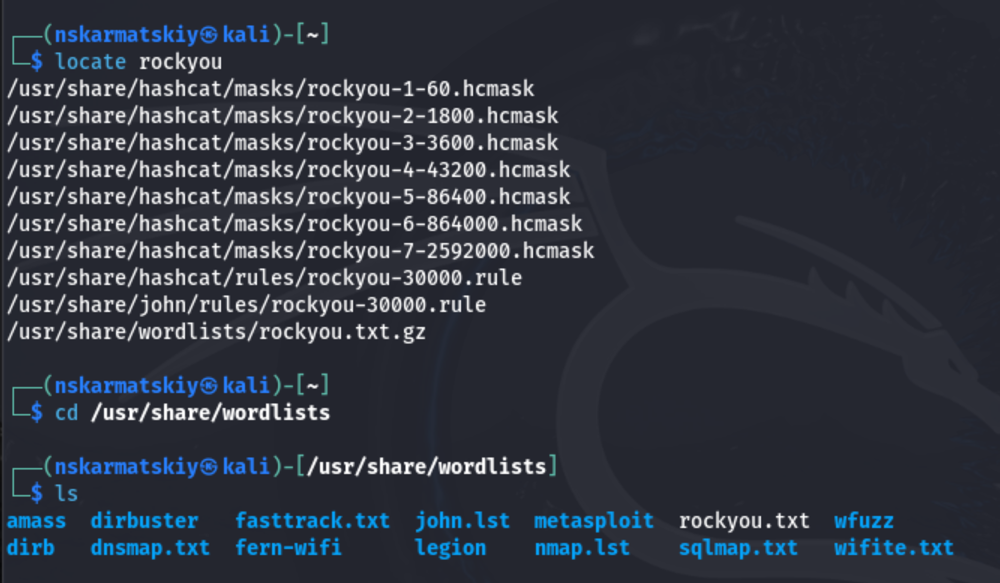
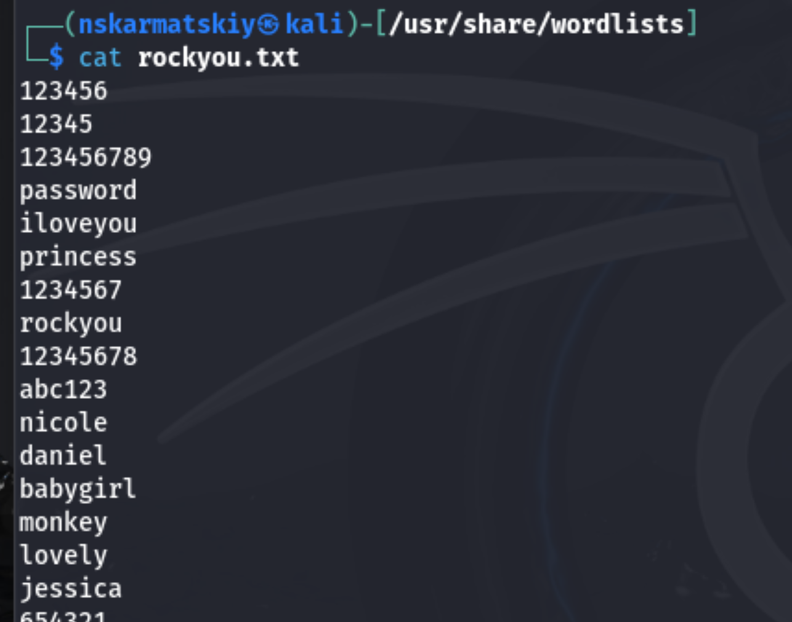
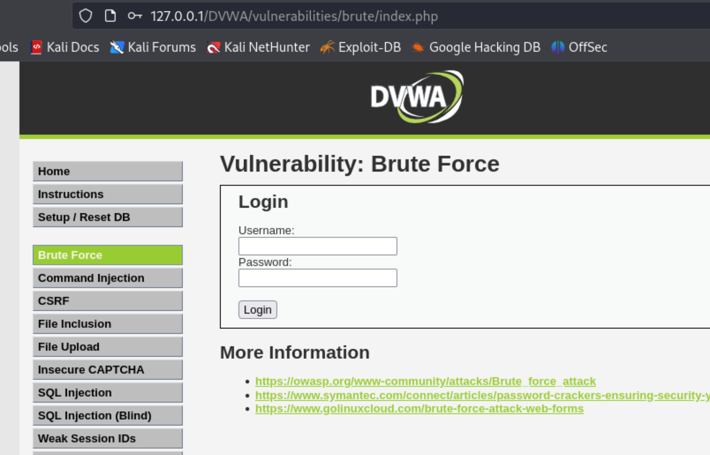
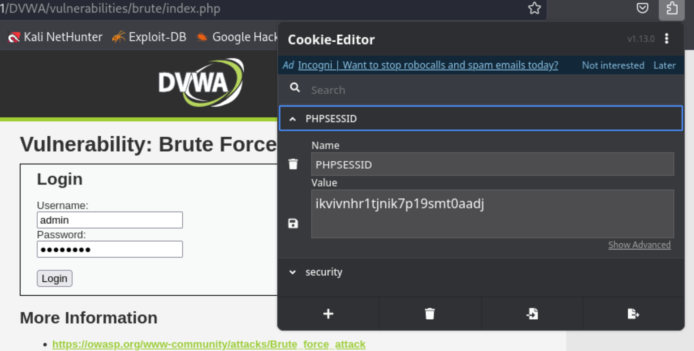
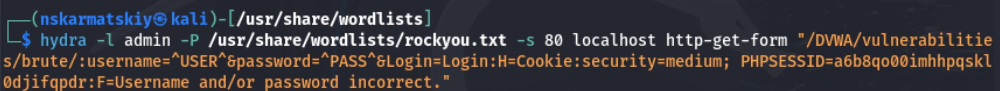
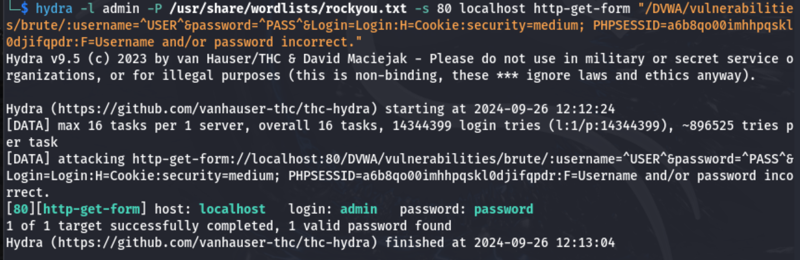
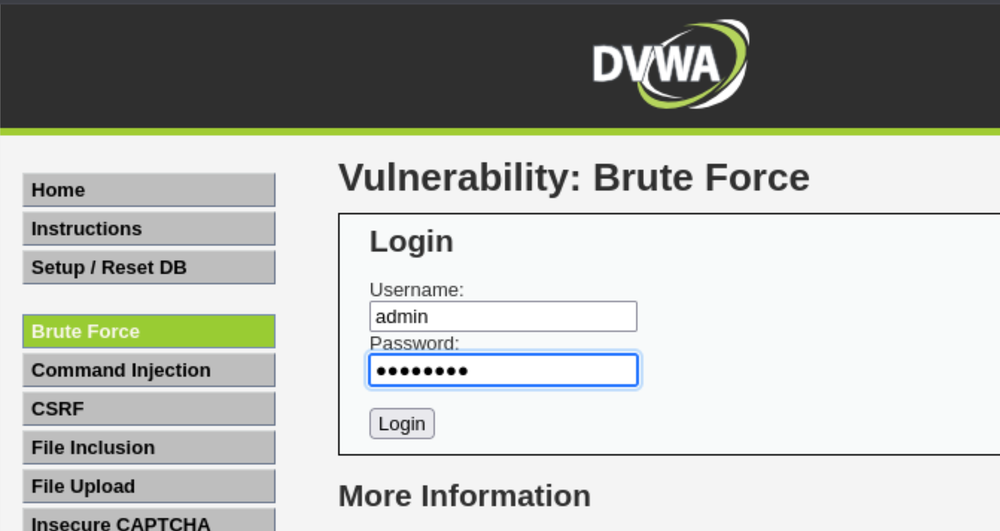
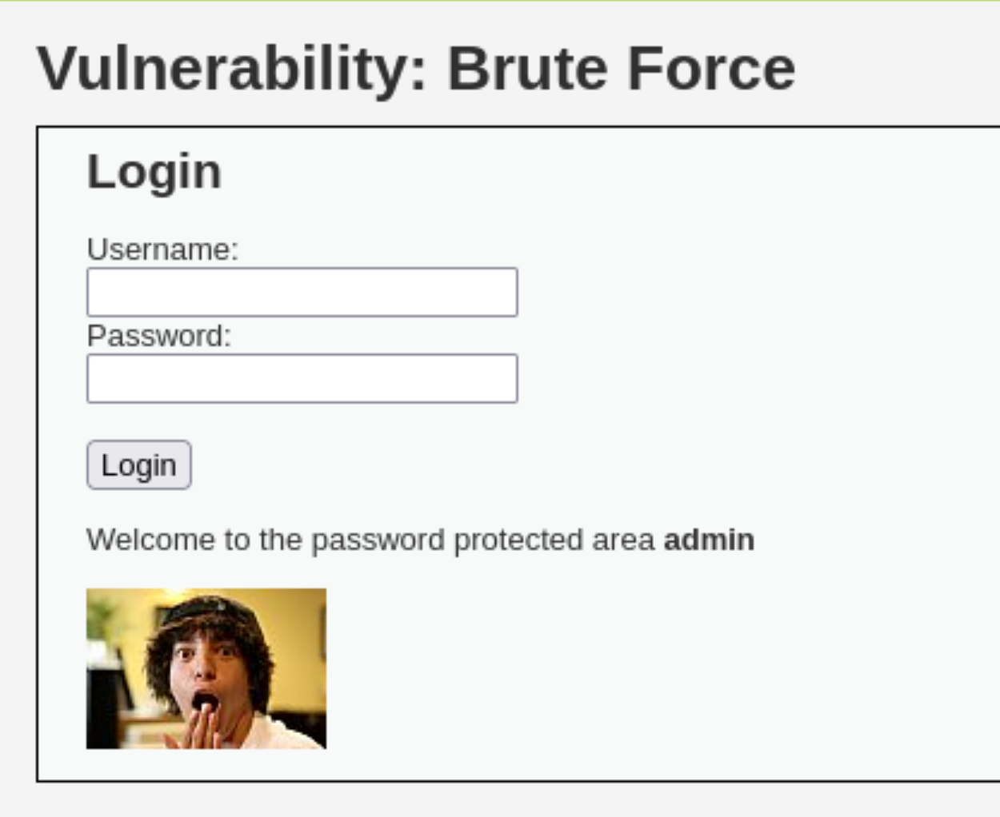

---
## Front matter
## Front matter
lang: ru-RU
title: "Индивидуальный проект"
subtitle: "Этап 3"
author: " Кармацкий Н. С. Группа НФИбд-01-21 "
institute:
  - Российский университет дружбы народов, Москва, Россия
date: 7 Сентября 2024

## i18n babel
babel-lang: russian
babel-otherlangs: english

## Formatting pdf
toc: false
toc-title: Содержание
slide_level: 2
aspectratio: 169
section-titles: true
theme: metropolis
header-includes:
 - \metroset{progressbar=frametitle,sectionpage=progressbar,numbering=fraction}
 - '\makeatletter'
 - '\beamer@ignorenonframefalse'
 - '\makeatother'
---

## Цель работы

Приобретение практических навыков по использованию инструмента Hydra для брутфорса паролей.

## Задание

1. Реализовать эксплуатацию уязвимости с помощью брутфорса паролей.

## Теоретическое введение

- Hydra используется для подбора или взлома имени пользователя и пароля.
- Поддерживает подбор для большого набора приложений [@brute, @force, @parasram].

# Выполнение лабораторной работы

## Список паролей 1

Для того, чтоб пробрутфорсит пароль, нужно сначала найти список частоиспользуемых паролей. Он есть уже в Kali Linux, поэтому нам нужно только его найти и разархивировать каталога с ним (рис. 1).

{#fig:001 width=50%}

## Список паролей 2

Прочитаем файл, чтоб удостовериться что это он (рис. 2).

{#fig:002 width=50%}

## Сайт DVWA

Заходим на сайт DVWA, в подпункт с Brute Force. Тут мы будм проверять правильность выданных данных с помощью Hydra (рис. 3).

{#fig:003 width=50%}

## Файлы cookie

Для получения пароля и логина нам нужны файлы cookie, поэтому устанваливаем расширение, которое поможет посмотреть их параметры, а так же скопировать их (рис. 4).

{#fig:004 width=50%}

## Запрос Hydra 1

Вводим в Hydra нужную информацию. пароль будем подбирать для пользователя admin, используя GET-запрос с двумя параметрами cookie: безопасность и PHPSESSID(параметры cookie) (рис. 5).

{#fig:005 width=50%}

## Запрос Hydra 2

Спустя небольшое количество времени получаем результат в виде подходящий пароля и логина для конкретного юзера (рис. 6).

{#fig:006 width=50%}

## Ввод данных в уязвимую форму

Вводим полученные данные на проверку (рис. 7).

{#fig:007 width=50%}

## Результат

Получааем положительный результат проверки пароля, а это значит что все сделано верно (рис. 8)

{#fig:008 width=50%}

## Выводы

Приобрели практические навыки по использованию инструмента Hydra для брутфорса паролей.

## Список литературы

[1] https://spy-soft.net/rockyou-txt/ - Словарь Rockyou.txt где находится в Kali Linux 
