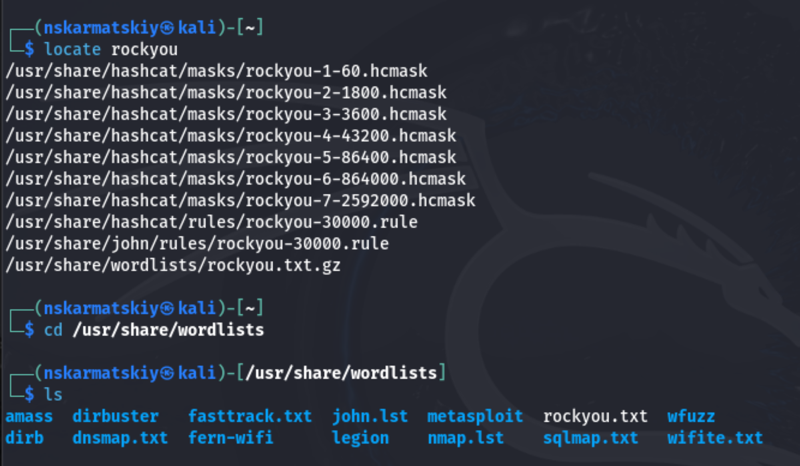
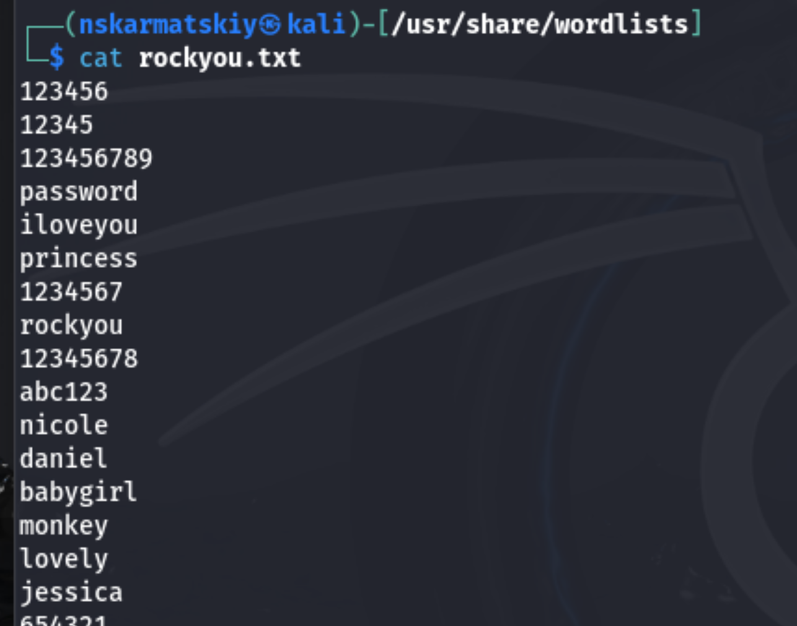
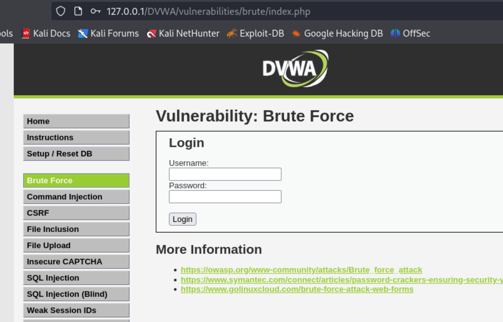
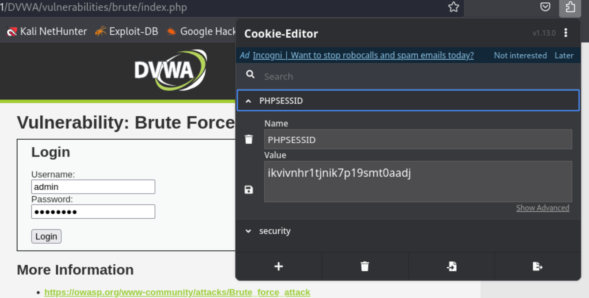
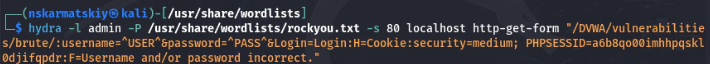
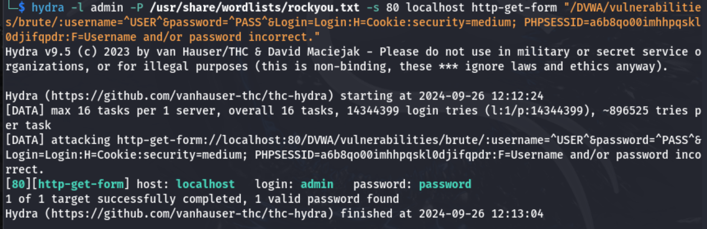
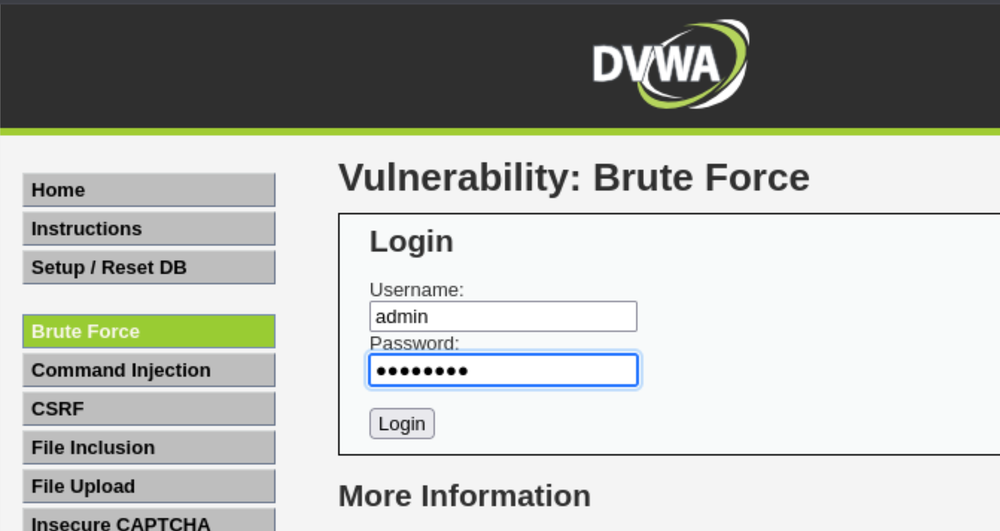
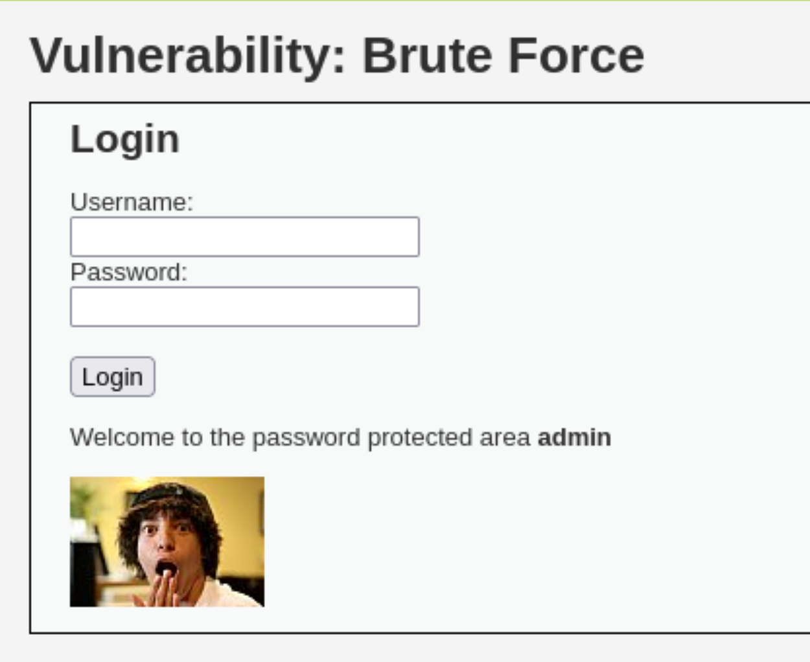

---
## Front matter
title: "Отчет по третьему этапу индивидуального проекта"
subtitle: "Информационная безопасность"
author: "Кармацкий Никита Сергеевич"

babel-lang: russian 
babel-otherlangs: english 
mainfont: Arial 
monofont: Courier New 
fontsize: 9pt

## Generic otions
lang: ru-RU
toc-title: "Содержание"

## Bibliography
bibliography: bib/cite.bib
csl: pandoc/csl/gost-r-7-0-5-2008-numeric.csl

## Pdf output format
toc: true # Table of contents
toc-depth: 2
lof: true # List of figures
fontsize: 9pt
linestretch: 1.5
papersize: a4
documentclass: scrreprt
## I16n polyglossia
polyglossia-lang:
  name: russian
  options:
  - spelling=modern
  - babelshorthands=true
polyglossia-otherlangs:
  name: english
## I16n babel
babel-lang: russian
babel-otherlangs: english
## Fonts
mainfont: PT Serif
romanfont: PT Serif
sansfont: PT Sans
monofont: PT Mono
mainfontoptions: Ligatures=TeX
romanfontoptions: Ligatures=TeX
sansfontoptions: Ligatures=TeX,Scale=MatchLowercase
monofontoptions: Scale=MatchLowercase,Scale=0.6
## Biblatex
biblatex: true
biblio-style: "gost-numeric"
biblatexoptions:
  - parentracker=true
  - backend=biber
  - hyperref=auto
  - language=auto
  - autolang=other*
  - citestyle=gost-numeric
## Pandoc-crossref LaTeX customization
figureTitle: "Рис."
tableTitle: "Таблица"
listingTitle: "Листинг"
lofTitle: "Список иллюстраций"
lolTitle: "Листинги"
## Misc options
indent: true
header-includes:
  - \usepackage{indentfirst}
  - \usepackage{float} # keep figures where there are in the text
  - \floatplacement{figure}{H} # keep figures where there are in the text
---

# Цель работы

Приобретение практических навыков по использованию инструмента Hydra для брутфорса паролей.

# Задание

1. Реализовать эксплуатацию уязвимости с помощью брутфорса паролей.

# Теоретическое введение

- Hydra используется для подбора или взлома имени пользователя и пароля.
- Поддерживает подбор для большого набора приложений [@brute, @force, @parasram].

**Пример работы**:

Исходные данные:

- IP сервера 178.72.90.181;

- Сервис http на стандартном 80 порту;

- Для авторизации используется html форма, которая отправляет по адресу http://178.72.90.181/cgi-bin/luci методом POST запрос вида username=root&password=test_password;

- В случае неудачной аутентификации пользователь наблюдает сообщение Invalid username and/or password! Please try again.

- Запрос к Hydra будет выглядеть примерно так:

`hydra -l root -P ~/pass_lists/dedik_passes.txt -o ./hydra_result.log -f -V -s 80 178.72.90.181 http-post-form "/cgi-bin/luci:username=^USER^&password=^PASS^:Invalid username"`

- Используется http-post-form потому, что авторизация происходит по http методом post.

- После указания этого модуля идёт строка /cgi-bin/luci:username=^USER^&password=^PASS^:Invalid username, у которой через двоеточие (:) указывается:

- путь до скрипта, который обрабатывает процесс аутентификации (/cgi-bin/luci);

- строка, которая передаётся методом POST, в которой логин и пароль заменены на ^USER^ и ^PASS^ соответственно (username=^USER^&password=^PASS^);

- строка, которая присутствует на странице при неудачной аутентификации; при её отсутствии Hydra поймёт, что мы успешно вошли (Invalid username).

# Выполнение лабораторной работы

Для того, чтоб пробрутфорсит пароль, нужно сначала найти список частоиспользуемых паролей. Он есть уже в Kali Linux, поэтому нам нужно только его найти и разархивировать каталога с ним (рис. 1).

{#fig:001 width=70%}

Прочитаем файл, чтоб удостовериться что это он (рис. 2).

{#fig:002 width=70%}

Заходим на сайт DVWA, в подпункт с Brute Force. Тут мы будм проверять правильность выданных данных с помощью Hydra (рис. 3).

{#fig:003 width=70%}

Для получения пароля и логина нам нужны файлы cookie, поэтому устанваливаем расширение, которое поможет посмотреть их параметры, а так же скопировать их (рис. 4).

{#fig:004 width=70%}

Вводим в Hydra нужную информацию. пароль будем подбирать для пользователя admin, используя GET-запрос с двумя параметрами cookie: безопасность и PHPSESSID(параметры cookie) (рис. 5).

{#fig:005 width=70%}

Спустя небольшое количество времени получаем результат в виде подходящий пароля и логина для конкретного юзера (рис. 6).

{#fig:006 width=70%}

Вводим полученные данные на проверку (рис. 7).

{#fig:007 width=70%}

Получааем положительный результат проверки пароля, а это значит что все сделано верно (рис. 8)

{#fig:008 width=70%}

# Выводы

Приобрели практические навыки по использованию инструмента Hydra для брутфорса паролей.

# Список литературы

[1] https://spy-soft.net/rockyou-txt/ - Словарь Rockyou.txt где находится в Kali Linux 
