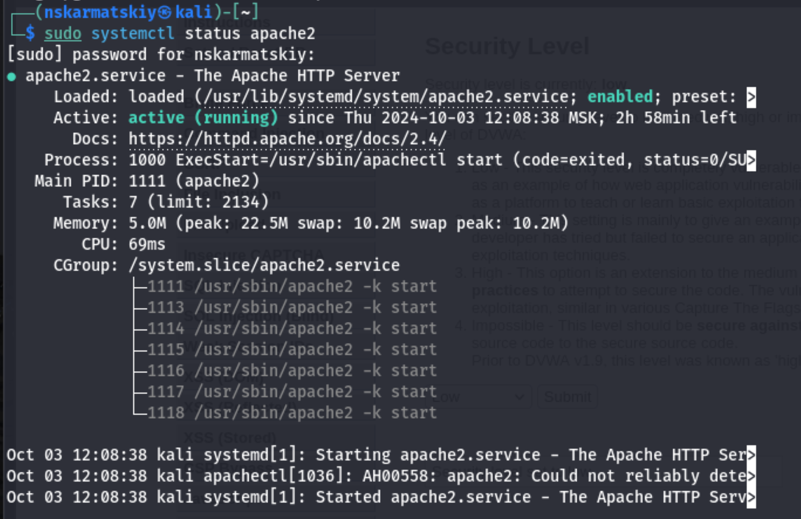
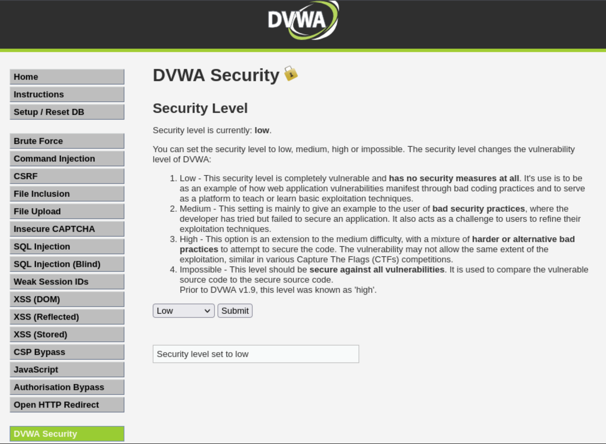
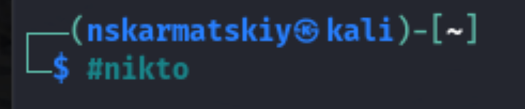
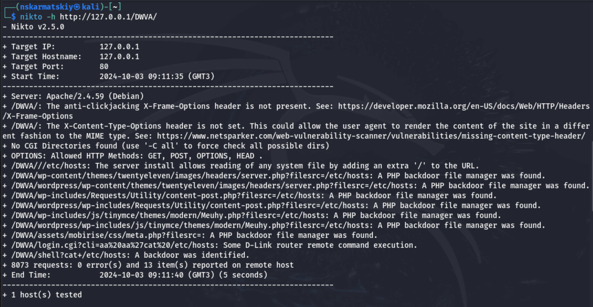
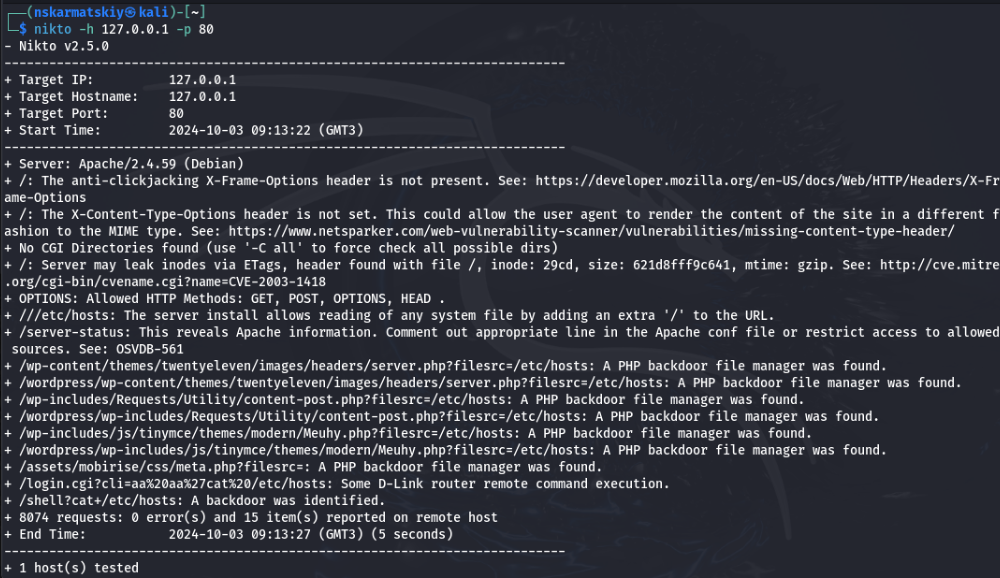

---
## Front matter
## Front matter
lang: ru-RU
title: "Индивидуальный проект"
subtitle: "Этап 4"
author: " Кармацкий Н. С. Группа НФИбд-01-21 "
institute:
  - Российский университет дружбы народов, Москва, Россия
date: 3 Октября 2024

## i18n babel
babel-lang: russian
babel-otherlangs: english

## Formatting pdf
toc: false
toc-title: Содержание
slide_level: 2
aspectratio: 169
section-titles: true
theme: metropolis
header-includes:
 - \metroset{progressbar=frametitle,sectionpage=progressbar,numbering=fraction}
 - '\makeatletter'
 - '\beamer@ignorenonframefalse'
 - '\makeatother'
---
## Цель работы

Научиться тестированию веб-приложений с помощью сканера nikto

## Задание

1. Использование nikto.

## Теоретическое введение

*nikto* — базовый сканер безопасности веб-сервера. Он сканирует и обнаруживает уязвимости в веб-приложениях, обычно вызванные неправильной конфигурацией на самом сервере, файлами, установленными по умолчанию, и небезопасными файлами, а также устаревшими серверными приложениями. Поскольку nikto построен исключительно на LibWhisker2, он сразу после установки поддерживает кросс-платформенное развертывание, SSL (криптографический протокол, который подразумевает более безопасную связь), методы аутентификации хоста (NTLM/Basic), прокси и несколько методов уклонения от идентификаторов. Он также поддерживает перечисление поддоменов, проверку безопасности приложений (XSS, SQL-инъекции и т. д.) и способен с помощью атаки паролей на основе словаря угадывать учетные данные авторизации.

Для запуска сканера nikto введите в командную строку терминала команду:
`# nikto`

# Выполнение лабораторной работы

## Сервер apache

Для работы с nikto, необходимо подготовить веб приложение, которое будем сканировать. В нашем случае это DVWA. Проверим, что сервер apache запущен (рис. 1).

{#fig:001 width=50%}

## Сайт DVWA

Заходим на наше веб-приложение и в режиме выбора уровня безопасности, ставим минимальный (рис. 2).

{#fig:002 width=40%}

## Запуск nikto

Запускаем nikto (рис. 3).

{#fig:003 width=50%}

## Запрос через url

Проверить веб-приложение можно, введя его полный URL и не вводя порт (рис. 4).

{#fig:004 width=50%}

## Запрос через адрес хоста и адрес порта

Затем попробовала просканировать введя адрес хоста и адрес порта, результаты незначительно отличаются (рис. 5).

{#fig:005 width=50%}

## Анализ результатов сканирования 1

Кроме адреса хоста и порта веб-приложения, никто выводит инофрмацию о различных уязвимостях приложения:

Разбор вывода сканирования Nikto:

nikto -h 125.0.0.1 -p 80: Эта команда инициирует сканирование Nikto против локального веб-сервера (IP-адрес 125.0.0.1) на порту 80, который является стандартным портом для HTTP.

## Анализ результатов сканирования 2

- Nikto v2.5.0: Указывает версию инструмента Nikto, используемую для сканирования.
- Target IP: 125.0.0.1: Показывает IP-адрес целевого объекта, который сканируется.
- Target Hostname: 125.0.0.1: Отображает имя хоста целевого объекта, которое в данном случае также является адресом обратной связи.
- Target Port: 80: Указывает, что сканирование проводится на порту 80.
- Start Time: 2024-10-03 09:13:22 (GMT3): Записывает время начала сканирования в часовой зоне GMT+3.
- Server: Apache/2.4.59 (Debian): Определяет программное обеспечение веб-сервера и его версию, работающую на целевом объекте, в данном случае это Apache версии 2.4.59 на операционной системе Debian.

## Анализ результатов сканирования 3

Находки уязвимостей:

- /: The anti-clickjacking X-Frame-Options header is not present.: Указывает на отсутствие заголовка X-Frame-Options, который помогает предотвратить атаки clickjacking.
- /: The X-Content-Type-Options header is not set.: Это предупреждение означает, что заголовок X-Content-Type-Options не настроен, что может позволить браузерам интерпретировать файлы неожиданным образом.

## Анализ результатов сканирования 4

- No CGI Directories found (use '-C all' to force check all possible dirs): Указывает на то, что во время сканирования не были обнаружены директории CGI; использование -C all может помочь найти их, если они существуют.
- /: Server may leak inodes via ETags...: Предупреждает о том, что используются ETags, которые могут привести к утечке информации о инодах файлов и их размерах, потенциально раскрывая структуру сервера или детали файловой системы.

## Выводы

Научились тестированию веб-приложений с помощью сканера nikto
