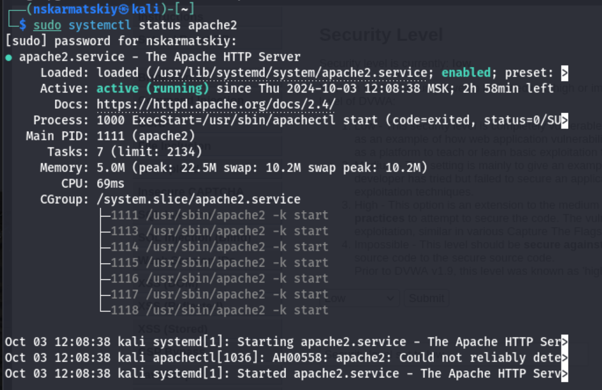
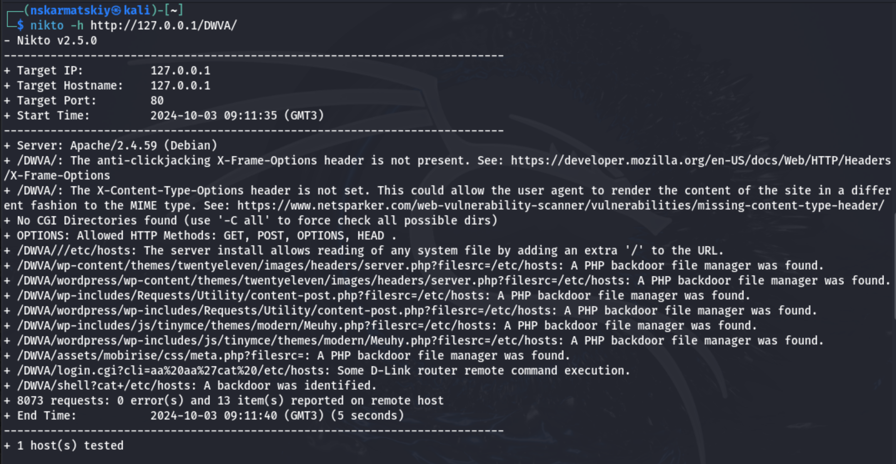
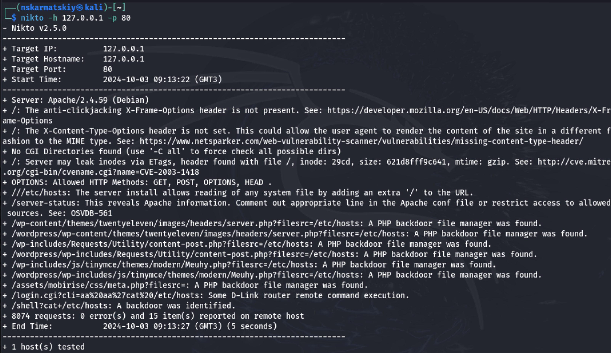

---
## Front matter
title: "Отчет по четвертому этапу индивидуального проекта"
subtitle: "Информационная безопасность"
author: "Кармацкий Никита Сергеевич"

babel-lang: russian 
babel-otherlangs: english 
mainfont: Arial 
monofont: Courier New 
fontsize: 9pt

## Generic otions
lang: ru-RU
toc-title: "Содержание"

## Bibliography
bibliography: bib/cite.bib
csl: pandoc/csl/gost-r-7-0-5-2008-numeric.csl

## Pdf output format
toc: true # Table of contents
toc-depth: 2
lof: true # List of figures
fontsize: 9pt
linestretch: 1.5
papersize: a4
documentclass: scrreprt
## I16n polyglossia
polyglossia-lang:
  name: russian
  options:
  - spelling=modern
  - babelshorthands=true
polyglossia-otherlangs:
  name: english
## I16n babel
babel-lang: russian
babel-otherlangs: english
## Fonts
mainfont: PT Serif
romanfont: PT Serif
sansfont: PT Sans
monofont: PT Mono
mainfontoptions: Ligatures=TeX
romanfontoptions: Ligatures=TeX
sansfontoptions: Ligatures=TeX,Scale=MatchLowercase
monofontoptions: Scale=MatchLowercase,Scale=0.6
## Biblatex
biblatex: true
biblio-style: "gost-numeric"
biblatexoptions:
  - parentracker=true
  - backend=biber
  - hyperref=auto
  - language=auto
  - autolang=other*
  - citestyle=gost-numeric
## Pandoc-crossref LaTeX customization
figureTitle: "Рис."
tableTitle: "Таблица"
listingTitle: "Листинг"
lofTitle: "Список иллюстраций"
lolTitle: "Листинги"
## Misc options
indent: true
header-includes:
  - \usepackage{indentfirst}
  - \usepackage{float} # keep figures where there are in the text
  - \floatplacement{figure}{H} # keep figures where there are in the text
---

# Цель работы

Научиться тестированию веб-приложений с помощью сканера nikto

# Задание

1. Использование nikto.

# Теоретическое введение

*nikto* — базовый сканер безопасности веб-сервера. Он сканирует и обнаруживает уязвимости в веб-приложениях, обычно вызванные неправильной конфигурацией на самом сервере, файлами, установленными по умолчанию, и небезопасными файлами, а также устаревшими серверными приложениями. Поскольку nikto построен исключительно на LibWhisker2, он сразу после установки поддерживает кросс-платформенное развертывание, SSL (криптографический протокол, который подразумевает более безопасную связь), методы аутентификации хоста (NTLM/Basic), прокси и несколько методов уклонения от идентификаторов. Он также поддерживает перечисление поддоменов, проверку безопасности приложений (XSS, SQL-инъекции и т. д.) и способен с помощью атаки паролей на основе словаря угадывать учетные данные авторизации. 

Для запуска сканера nikto введите в командную строку терминала команду:
`# nikto`

По умолчанию, как ранее было показано в других приложениях, при обычном
запуске команды отображаются различные доступные параметры. Для сканирования цели введите `nikto -h <цель> -p <порт>`, где <цель> — домен или IP-адрес
целевого сайта, а <порт> — порт, на котором запущен сервис

Сканер nikto позволяет идентифицировать уязвимости веб-приложений, такие
как раскрытие информации, инъекция (XSS/Script/HTML), удаленный поиск
файлов (на уровне сервера), выполнение команд и идентификация программного
обеспечения. В дополнение к показанному ранее основному сканированию nikto
позволяет испытателю на проникновение настроить сканирование конкретной
цели. Рассмотрим параметры, которые следует использовать при сканировании.

- Указав переключатель командной строки -T с отдельными номерами тестов, можно настроить тестирование конкретных типов.
- Используя при тестировании параметр -t, вы можете установить значение
тайм-аута для каждого ответа.
- Параметр -D V управляет выводом на экран.
- Параметры -o и -F отвечают за выбор формата отчета сканирования.

Существуют и другие параметры, такие как -mutate (угадывать поддомены,
файлы, каталоги и имена пользователей), -evasion (обходить фильтр идентификаторов) и -Single (для одиночного тестового режима), которые можно использовать для углубленной оценки цели [@parasram].

# Выполнение лабораторной работы

## Выполнение основных действий

Для работы с nikto, необходимо подготовить веб приложение, которое будем сканировать. В нашем случае это DVWA. Проверим, что сервер apache запущен (рис. 1).

{#fig:001 width=70%}

Заходим на наше веб-приложение и в режиме выбора уровня безопасности, ставим минимальный(это необязательно так как nikto при обычном сканировании для режима impossible и low выдаст одинаковые потенциальные уязвимости, что логично, ведь они остаются, но изменяется сложность, с которой их можно использовать) (рис. 2).

{#fig:002 width=70%}

Запускаем nikto (рис. 3).

{#fig:003 width=70%}

Проверить веб-приложение можно, введя его полный URL и не вводя порт (рис. 4).

{#fig:004 width=70%}

Затем попробовала просканировать введя адрес хоста и адрес порта, результаты незначительно отличаются (рис. 5).

{#fig:005 width=70%}

## Анализ результатов сканирования

Кроме адреса хоста и порта веб-приложения, никто выводит инофрмацию о различных уязвимостях приложения:

Разбор вывода сканирования Nikto:

nikto -h 127.0.0.1 -p 80: Эта команда инициирует сканирование Nikto против локального веб-сервера (IP-адрес 127.0.0.1) на порту 80, который является стандартным портом для HTTP.

- Nikto v2.5.0: Указывает версию инструмента Nikto, используемую для сканирования.
- Target IP: 127.0.0.1: Показывает IP-адрес целевого объекта, который сканируется.
- Target Hostname: 127.0.0.1: Отображает имя хоста целевого объекта, которое в данном случае также является адресом обратной связи.
- Target Port: 80: Указывает, что сканирование проводится на порту 80.
- Start Time: 2024-10-03 09:13:22 (GMT3): Записывает время начала сканирования в часовой зоне GMT+3.
- Server: Apache/2.4.59 (Debian): Определяет программное обеспечение веб-сервера и его версию, работающую на целевом объекте, в данном случае это Apache версии 2.4.59 на операционной системе Debian.

Находки уязвимостей:

- /: The anti-clickjacking X-Frame-Options header is not present.: Указывает на отсутствие заголовка X-Frame-Options, который помогает предотвратить атаки clickjacking.
- /: The X-Content-Type-Options header is not set.: Это предупреждение означает, что заголовок X-Content-Type-Options не настроен, что может позволить браузерам интерпретировать файлы неожиданным образом.
- No CGI Directories found (use '-C all' to force check all possible dirs): Указывает на то, что во время сканирования не были обнаружены директории CGI; использование -C all может помочь найти их, если они существуют.
- /: Server may leak inodes via ETags...: Предупреждает о том, что используются ETags, которые могут привести к утечке информации о инодах файлов и их размерах, потенциально раскрывая структуру сервера или детали файловой системы.

Дополнительные находки:

- OPTIONS: Allowed HTTP Methods: GET, POST, OPTIONS, HEAD .: Перечисляет допустимые HTTP методы, которые разрешены сервером; это может указывать на потенциальные области для эксплуатации, если такие методы как PUT или DELETE включены.
- ///etc/hosts:: Указывает на то, что доступ к /etc/hosts через URL с дополнительным слэшем позволяет читать конфиденциальные системные файлы, что представляет собой риск безопасности.
- /server-status:: Сообщает о том, что доступ к /server-status может раскрыть конфиденциальную информацию о сервере; доступ к нему следует ограничить только авторизованным пользователям.

Обнаружение PHP-бэкдоров:

- /wp-content/themes/twentyeleven/images/headers/server.php?filesrc=/etc/hosts: Этот шаблон повторяется для нескольких путей, указывая на то, что обнаружен PHP-бэкдор (файл менеджер), позволяющий потенциальный несанкционированный доступ к системным файлам.

Удаленное выполнение команд:

- /login.cgi?cli=aa%20aa%27cat%20/etc/hosts: и
- /shell?cat+/etc/hosts: 
Эти строки указывают на то, что были обнаружены уязвимости удаленного выполнения команд, позволяющие злоумышленникам выполнять команды на сервере и читать конфиденциальные файлы, такие как /etc/hosts, что может привести к дальнейшей эксплуатации.

# Вывод

Научились тестированию веб-приложений с помощью сканера nikto

# Список литературы

